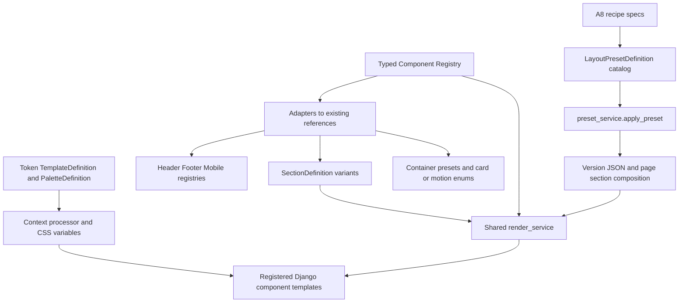
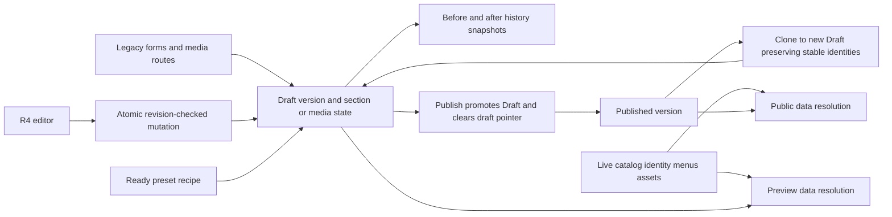
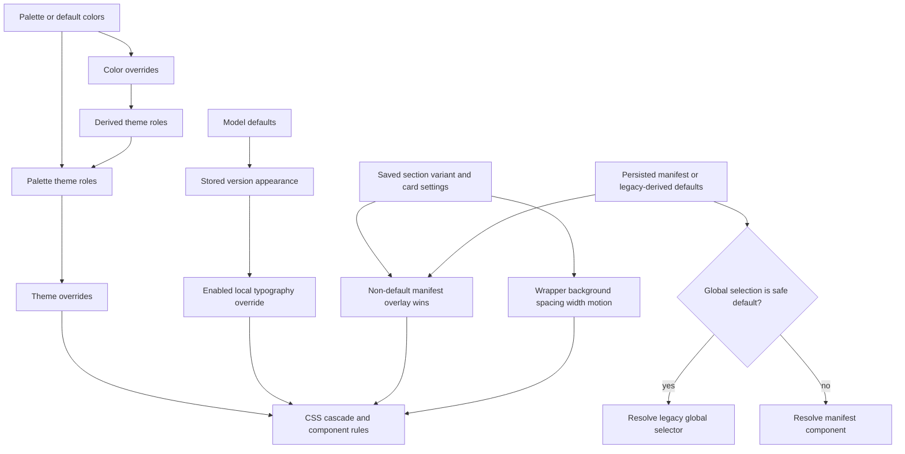
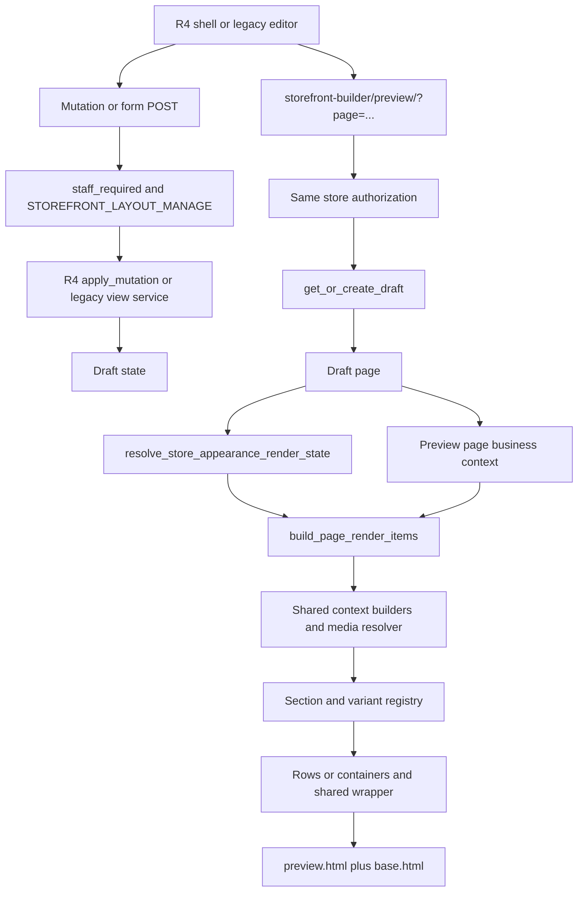
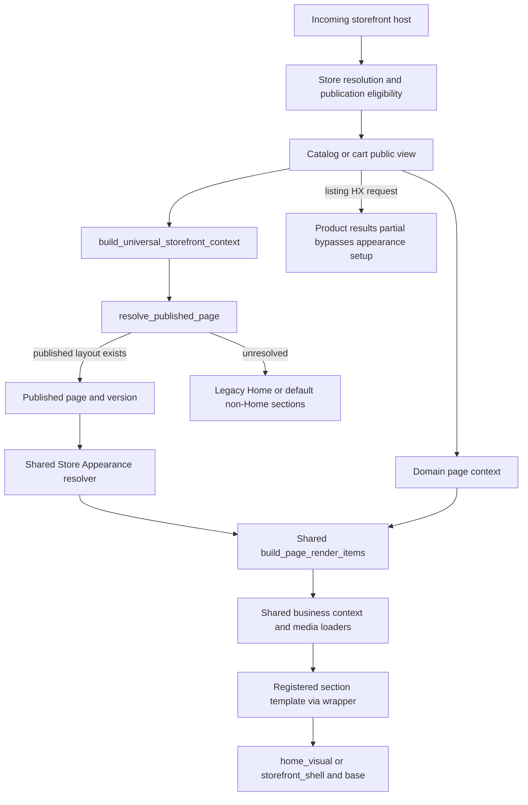

# Storefront Appearance / Builder Architecture Audit

Date: 2026-09-05. Baseline: `93c5afea2ee32bef67cfb5923ffdb13bb61d7930`.

## 1. Executive Summary

**G2.3 BASELINE: VERIFIED.** This is an architecture audit, not an implementation plan or redesign. No implementation or refactor was performed.

**Assessment: a substantially shared rendering engine and version lifecycle, with incomplete convergence of its editing, appearance-selection, media-reference and fragment-rendering boundaries.** The hypothesis “fix one and break another” is supported at these boundaries. It is not supported as a description of all component variants or as evidence for rewriting the commerce system.

Numerical findings (counting conventions and supporting inventories follow):

| Question | Verified answer |
|---|---|
| Major persisted appearance authorities | **5 authority groups**: live store identity/content settings; version appearance tokens; typed component manifest inside that same JSON; section settings; container/cell layout settings. These are conceptual groups, not five databases or five equivalent implementations. Baseline snapshots/history are intentional copies, not extra live authorities. |
| Major registry catalogs | **12 catalogs in 8 modules**, counting the three global-region catalogs separately and the latest/versioned preset indexes as one catalog. Supporting dispatch/recipe maps are also identified in §10; not all are competing authorities. |
| Component families | **10 registered Store Appearance families**, not the complete product-facing family taxonomy. Brand, Category, Collection, Newsletter and others instead live in the section registry. |
| Section inventory | **36 registered section types; 30 explicit variant entries across 7 section types; 4 schema-enabled section types.** A section without explicit variants still has a registered default renderer. |
| Global variants | Header **22**, Footer **16**, Mobile Bottom Navigation **9**, including legacy/default/hidden entries. No independent MegaHeader/MegaFooter registry; mega_menu has only a virtual none entry. |
| Typed component catalog | **119 component keys, 90 distinct registry references**. Aliases/default markers inflate the key count; these are not 119 distinct visual implementations. |
| Templates | **50 latest Ready Templates**, **55 latest presets total**, **63 retained key/version preset entries**, **10 token-template profiles**, **64 palettes**. All 50 Ready Templates declare all six page types. |
| Confirmed parallel/overlapping responsibilities | **14**, enumerated C01–C14 in §22. This deliberately includes compatibility and intentional layering; it is not a count of 14 harmful duplicate engines. |
| Suspected additional duplicates | **0 counted**. Unverified consequences and adoption questions remain UNKNOWN rather than being inflated into duplicate findings. |
| Preview/Public | Shared section/context/variant/media core; different outer views and asset envelopes; live fragment routes bypass some composition/appearance work. Neither “fully unified” nor “two independent engines” is accurate. |
| Draft/Published | One version model and promote/clone/restore lifecycle. Not all editing paths share its concurrency boundary; business content and some media fallbacks remain live. |
| Appearance precedence | Deterministic but distributed and concept-specific. Global manifest selections can beat section selections, while enabled section typography beats global typography. No general Page Override layer. |
| Templates: recipes or independent implementations? | Ready Templates are recipes using registered components. A reachable static campaign hero and older unpublished-store fallback remain separate paths. Retired SHOP_FAMILY renderers are not active. |
| Business data | Mostly shared server-side builders/domain services. Brand variants share one loader. Product cards share one DTO, with special-offer presentation exceptions and duplicated query policies in older product sections. |

Registered explicit section variant counts: Hero 6; Category 11; Brand 3; Image/Text 2; Product Section 3; Catalog Product Wall 3; Collection Tiles 2. Image Slider, Story Rail, Newsletter and the other section types have zero explicit VariantDefinition entries, not zero renderers. Full key inventories are in §13.

Top five P0/P1 risks:

1. **P0 — competing appearance writers:** older forms can discard the typed manifest or save header/footer selectors the manifest overrides (C02).
2. **P1 — incomplete concurrency boundary:** legacy section/media/publish routes remain callable outside R4 revision checks (C04).
3. **P1 — full-page/fragment divergence:** listing filter responses lose section card settings; cart fragments ignore container rendering state (C09).
4. **P1 — media reference lifetime mismatch:** JSON background references are invisible to asset reference counting (C11).
5. **P1 — styling ownership conflicts:** global forced theme rules, component rules and inline fallbacks jointly own presentation; preview also loads a different non-Home asset envelope (C10).

Top five things to preserve: (1) store/domain/membership authorization boundaries; (2) catalog, price, visibility, collection and cart business services; (3) shared render_service and its scoped context builders; (4) versioned layout lifecycle, stable section identities and history/baseline snapshots; (5) trusted registries, renderer allowlists and recipe-based Ready Templates.

## 2. Audit Scope and Method

Work was restricted to `D:\Projects\RastiSi4_Golden_Manual`. The sole intended repository write is this report. No checkout, stash, reset, clean, restore, commit, push, migration creation, application edit or database mutation was performed by the audit.

Evidence labels:

- **FACT**: directly observed source, command output or narrowly scoped runtime result.
- **INFERENCE**: consequence deduced from a traced path; not a claim of observed production incidence.
- **RECOMMENDATION**: future architectural decision, requiring separate approval/work.
- **UNKNOWN**: cannot be established from static source or the validation performed.

Paths below are relative to the confirmed repository root; `path:line` identifies evidence at this commit. Symbol names accompany larger spans. Runtime reachability means a registered path can be selected by source code, not that a deployed merchant currently uses it. “Preset use” counts latest code recipes only, not database instances. No tenant/business data dump was needed.

Read repository guidance in `CLAUDE.md` and `.claude/skills/rastisi-code-map/SKILL.md`. Graphify's `graphify-out/graph.json` was absent; followed the skill's explicit normal-source-navigation fallback. Read `docs/README.md`, the unified architecture design (`docs/superpowers/specs/2026-09-03-rastisi-storefront-builder-unified-architecture-design.md`) and historical six-family wiring report for context. Important historical claims were checked against current source. For example the README's backend/frontend layout description and old SHOP_FAMILY report do not describe the current rendering paths reliably.

Method: route → authorization → view → service → persistence → registry → template/CSS/JS → existing assertions. Enumerated imported registries after Django setup, without saving/querying business models. Compiled registered renderer templates without rendering requests. Used in-memory model objects to verify conflicting selectors. Inspected integration-test assertions but did not run database-backed suites or invoke preview/public HTTP views, which can create Drafts, carts or product view counts.

Validation commands and results:

```powershell
git rev-parse --show-toplevel
git status
git branch --show-current
git rev-parse HEAD
git remote -v
python --version
python -m django --version
git cat-file -t 93c5afea2ee32bef67cfb5923ffdb13bb61d7930
git merge-base --is-ancestor 93c5afea2ee32bef67cfb5923ffdb13bb61d7930 HEAD
git rev-parse rastisi5/fix/g2.3-builder-public-content-appearance-consistency
git merge-base --is-ancestor 0276a5d085a4d98c4cb992d35148b45c745a3d5a HEAD
$env:PYTHONDONTWRITEBYTECODE='1'
python manage.py check
python manage.py makemigrations --check --dry-run
python -B manage.py test apps.storefront_builder.tests.test_r4_store_appearance_contracts apps.storefront_builder.tests.test_r4_store_appearance_registry apps.storefront_builder.tests.test_r4_store_appearance_validation apps.storefront_builder.tests.test_r4_store_appearance_compatibility --verbosity 1
```

Both ancestor checks returned exit 0. Django check: `System check identified no issues (0 silenced).` Migration check: `No changes detected`. Focused existing SimpleTestCase suites: **42 tests passed**, 0.006 seconds reported test time; no test database setup. This is not a claim that all integration tests pass.

Additional read-only Python invocations used `python -B -` through PowerShell here-strings: imported `section_registry`, `appearance_registry`, `layout_preset_registry`, `global_region_registry`, `storefront_appearance.registry`; enumerated lengths/keys and preset section references; applied `get_template()` to the union of default and variant renderer paths (**90 paths compiled**). Probe: constructed an unsaved-in-memory `StorefrontLayoutVersion(pk=999)` with manifest header `header.dark_tech.v1` and legacy selector `boutique_centered`; `global_renderer_template()` returned `global_header/dark_tech.html`. `validate_appearance_config({'font':'Tahoma'})` returned no `store_appearance` key, matching the older form's omission. No save was invoked.

Some exploratory searches failed due to PowerShell wildcard path handling, two Python outputs needed UTF-8 stdout, and inventory introspection initially used an incorrect attribute name (`allowed_page_types`; corrected to `page_types`). Corrected reads succeeded; these were navigation errors, not application validation failures. No files were changed to resolve them.

## 3. Repository Baseline

| Item | Observed |
|---|---|
| Actual root | `D:/Projects/RastiSi4_Golden_Manual` |
| Branch | `audit/storefront-appearance-g23` |
| HEAD | `93c5afea2ee32bef67cfb5923ffdb13bb61d7930` |
| Initial status | `nothing to commit, working tree clean`; short status empty |
| Upstream | `rastisi5/fix/g2.3-builder-public-content-appearance-consistency`; same commit |
| origin fetch/push | `https://github.com/manouchehr94-ux/RastiSi4.git` |
| rastisi5 fetch/push | `https://github.com/manouchehr94-ux/rastisi5.git`; repository guidance calls this canonical |
| Python / Django | 3.12.10 / 5.2.16 |
| Commit existence / ancestry | Commit object exists, equals HEAD, ancestor test exit 0 |
| Specified base | `0276a5d085a4d98c4cb992d35148b45c745a3d5a` is an ancestor |

All four G2.3 files are present at the exact commit: `apps/storefront_builder/section_registry.py` (valid background mode persistence); `apps/storefront_builder/templates/storefront_builder/sections/brand_carousel.html` (inline layout resilience); `apps/storefront_builder/tests/test_g23_builder_public_content_appearance.py` (14 regressions); `apps/storefront_builder/tests/test_section_registry.py` (updated background expectation). Exact commit identity is stronger evidence than an approximate equivalent-change comparison. The audit did not need to fetch or move branches.

Final write verification is recorded in §33. Initial dirty state was empty; there are no pre-existing changes to distinguish.

## 4. Current System Architecture Overview

**FACT:** `models.py:188,232,518,577,766,830` defines StorefrontLayout → StorefrontLayoutVersion → StorefrontPage → Sections plus Containers/Cells. Layout has Draft and Published pointers. Version holds header/footer/global appearance, manifest, provenance and reset baseline. Public resolution checks the visual-layout flag and Published pointer (`services/page_resolution_service.py:49–112`).

**FACT:** Rendered sections use one `render_service._build_items_from_sections()` (`:714–845`). It chooses definitions, applies manifest presentation overlays, builds data, resolves section typography/background media and chooses a trusted variant template. Preview calls this via `build_page_render_items`; the public context service calls the same function. Thin home compatibility entry `build_render_items()` is not another engine (`render_service.py:1041`).

**FACT:** Business data is generally not snapshotted with appearance. Catalog products, brand names/logos, collection metadata, navigation and ShopSettings remain domain-owned live data. Publish freezes layout configuration and section placements, not the entire business database.

Diagram D — current template/component/variant relationship:



The component registry is an adapter catalog over existing implementations, not proof of a second renderer. But selected component identities and legacy/local selector fields have overlapping authority, examined below.

## 5. Appearance Persistence Map

| Persisted concept | Storage and versioning | Writers | Readers / Preview and Public | Authority and copies |
|---|---|---|---|---|
| Active lifecycle | StorefrontLayout draft_version, published_version, uses_visual_storefront_layout (`models.py:195–214`) | layout_service get/create, publish, discard, restore | Preview gets Draft; Public page resolver gets Published | Canonical pointers; R4 flag selects editor availability, not another lifecycle |
| Global tokens and token-template/palette identity | Version.appearance_config (`:267`, defaults `:142`) | R4 appearance update, legacy appearance form, presets, bootstrap | core.context_processors and render_service | Canonical for versioned appearance; ShopSettings is live fallback/seed |
| Typed family selection | appearance_config.store_appearance, schema_version=1, selections/settings (`persistence.py:23,84,106`) | persist_store_appearance_manifest, R4 component/manifest/template commands, preset overlay | resolve_store_appearance_render_state in both flows | Co-located JSON, not separate model; header/footer/motion mirrored into legacy fields |
| Header/footer presentation | Version.header_config/footer_config (`models.py:265–266`) | legacy editors, R4 updates, manifest persistence, presets | effective configs and global renderer adapter | Toggles/content settings still read here even when manifest chooses renderer |
| Page ownership | StorefrontPage version/type (`:542–546`) | version creation ensures six pages | both render paths | No dedicated page appearance JSON; sections can vary by page |
| Section data/presentation | StorefrontSection.settings, section_key, order, stable_id, template_slot_key, active/locked flags (`:601–708`) | R4 schema patches; legacy forms; structure/preset/history services | shared render/context/variant functions | Content and local appearance mixed in one settings object; global overlay can supersede local presentation |
| Container layout | Container.settings/layout_key/order/stable_id, Cell.span/settings/order, Section.cell/cell_order | container and legacy row services, preset rebuilding | container renderer; row renderer fallback | Cell block relation preferred; legacy one-to-one pointer and row fields remain copies/bridges |
| Template reset identity | template_provenance; template_baseline_snapshot; section template_slot_key (`:280–310,633`) | preset apply, clone, restore | reset functions | Intentional immutable baseline copy, not runtime renderer authority |
| Undo/redo | StorefrontEditHistoryEntry before_state/after_state/sequence/is_undone (`:896–940`) | edit_history_service; legacy history decorator; R4 mutation wrapper | undo/redo restore Draft | Version-scoped; publish deletes edit history; archived versions retain content |
| Media placements | HeroSlide/PromotionalBanner/StoryRailItem section FK, legacy file fields, MediaAsset FKs | media_views; clone helper; content/domain editors | placement URL properties in shared templates | Placement metadata versioned by clone; file assets shared; fallback to store-wide rows |
| Background image | settings.background.media_asset_id JSON | legacy settings form with ownership validation | resolve_background_media_url(store, background) | Same asset store, reference is not visible to MediaAsset.is_referenced |
| Live store identity and footer content | ShopSettings, FooterSettings, Menu/MenuItem, SocialLink, badges/logos | dashboard settings/content editors | context processors run on both Preview/Public | Domain-owned and unversioned; overlaps color/presentation and footer visibility |
| Catalog media | ProductImage, Brand.logo, MerchantCollection.image; Category representative product media | business editors | product card DTO, Brand/Collection builders | Separate business media ownership; not Draft copies |
| Static campaign/demo/gallery media | static files plus recipe keys/settings.slides filenames | source recipes/assets and capture command | fashion hero; thumbnail/screenshot service | Source-versioned, not merchant MediaAsset lifecycle |
| Frontend temporary state | RastiSiR4 selected/revision/queue/inspector/saveState/conflict (`r4_editor.js:1–9`) | JS from server shell and responses | editor only; successful mutations reload iframe | No durable localStorage/sessionStorage appearance authority found in Builder JS/templates searched |

Diagram A — current persistence flow:



## 6. Current Appearance Precedence

There is **no single universal override ladder**. Current rules are:

1. Version effective config is a shallow merge of APPEARANCE_CONFIG_DEFAULTS and stored JSON (`models.py:385–393`). Token-template values are often copied at edit/apply time, not inherited dynamically for every field. Structural fields absent in JSON fall back to TemplateDefinition in `core/context_processors.py:178–201`.
2. Colors: DEFAULT_COLORS or palette.colors → color_overrides (`appearance_registry.py:156–162`). Theme roles: roles derived from resolved colors → palette.theme_roles → theme_overrides (`:174–199`). A palette's explicit header role can therefore remain unchanged by a general surface-color override.
3. Tones: stored palette.section_tones only when there are no color overrides; otherwise derive five tones from resolved colors (`:202–225`).
4. Typed manifest: use persisted validated manifest; if missing/empty, synthesize it from legacy global selectors and defaults (`persistence.py:57–93`). For global safe-default components, rendering delegates back to legacy selector; other selections choose their own renderer (`rendering.py:105–142`).
5. Section variant/card/badge: **non-default manifest overlay wins over saved section settings** (`render_service.py:743–761`). This is the reverse of the target's general Section Override priority. It does not rewrite stored settings.
6. Typography: enabled, valid section appearance_overrides.typography changes font/type_scale over global config (`section_appearance_service.py:15–44`). Supported only on selected section types; no universal heading/body/color/border/shadow override object.
7. Background/spacing/layout/motion/responsive: per-section settings drive shared wrapper attributes/styles (`responsive_section_wrapper.html:44–56`); CSS and inner component rules determine the final cascade. Container settings independently affect the enclosing layout.
8. No explicit Page Override layer exists. Page-specific settings currently mean settings on page-owned sections or hardcoded page template/CSS.

Diagram E — current precedence, not target architecture:



**INFERENCE:** Appearance controls that describe themselves generically as an override cannot be understood without naming the concept and path. A global card change may intentionally override every section, while a local typography change survives. That is maintainable only with an explicit contract and consistent editors.

## 7. Builder / Draft / Preview Flow

Route root is `shop_core/urls.py:41` → `/admin-portal/`; actual Builder URLs are in `apps/dashboard/urls.py:219–300`. There is no standalone apps/storefront_builder/urls.py.

Diagram B:



`views.storefront_preview:217–289` retrieves/creates Draft and chooses one of six page types. Preview is not read-only at runtime: `get_or_create_draft` can clone/bootstrap and ensure containers (`layout_service.py:722–756`). This audit did not call it.

Preview representative data (`views.py:170–209`): newest visible product for detail; standard listing context for listing/search; latest public collection; empty cart context. Hero/Brand/Collection section data still comes from shared builders. Outer request gets Draft as storefront_appearance_version for global context processors. Optional `preview_template` changes a candidate token-template context **after** section render items were constructed (`:257–263`), so candidate-preview global tokens and precomputed section appearance are separate inputs.

R4 flow (`r4_editor.js:90–150`; `r4_views.py:262–300`): queue → JSON {base_revision, mutation} → CSRF-protected POST → gated active layout → locked Draft → validation → mutation/history → revision response → iframe reload. Conflict 409 stops automatic mutation continuation. R4 structure operations are Home-scoped (`section_structure_service.py:30–43,78–105`). Section update requires a SettingsSchema; currently only Hero, Product Section, Brand and Rich Text have one. Other editing remains on older routes.

Add/remove/reorder: registry enforces allowed page, instance count, hidden-from-library and remove/duplicate flags; SectionStructureService calls container placement helpers. Legacy view routes expose page-aware row/container/cell operations. Section.order controls flattened evaluation; container order/cell order and Section.cell_order determine composition placement. Removal, clear, hide and lock are distinct operations. Container layout change preserves blocks by moving/merging cells; this is not the same as applying a new template, which replaces pages.

Variant switching: R4 schema patch merges current settings before family validation (`settings_schema.py:310–371`) and saves the same section row (`r4_mutation_service.py:132–186`). Hero/Brand local switching preserves compatible title/source/background values that validators retain. There is no per-variant settings history map; ordinary undo/history is not “remember each variant's last customization.” The legacy form builds a new raw dictionary and replaces settings (`views.py:795–918`), so unrepresented keys can be dropped. Store Appearance component switching changes global manifest selection, not section identity/content; the render overlay can conceal the local variant. Applying a Ready Template is a different, destructive-to-composition operation (§15).

## 8. Published / Public Flow

Diagram C:



Routes: catalog home/list/detail/collections in `apps/catalog/urls.py`; cart in `apps/cart/urls.py`; composed by `shop_core/urls.py:34–44`. `resolve_store_for_storefront` enforces publication eligibility (`apps/stores/resolution.py:300–335`); admin ownership is not reused as public visibility.

Full views (`catalog/views.py:48–120,353–376,500–526,569–610`; `cart/views.py:63–82`) build domain data, then add universal context. `storefront_context_service.py:56–181` selects Published, resolves manifest once, passes page context to the shared renderer, hides empty optional product sections, selects global renderer templates and builds containers. Public never intentionally falls back to Draft.

Unpublished/visual-flag-off Home uses `catalog/home.html` and direct legacy data queries. Unresolved non-Home pages use default ephemeral sections (`render_service.py:848–877`, `bootstrap_service.py:114–134`) and base shell. These compatibility paths are active conditions, not dead source.

Published layout is not a whole-store content snapshot. Brand rename/logo edits and other catalog changes immediately affect both render paths. Section media can fall back to store-wide active rows when no active scoped placement exists (`render_service.py:52–96`). A Published page's content can therefore change without a new layout publication.

## 9. Preview vs Public Comparison

| Boundary | Preview | Public | Assessment |
|---|---|---|---|
| Authorization | Store staff membership plus layout permission | Host resolution plus public eligibility | Intentional difference |
| Lifecycle source | Draft, possibly created by GET | Published pointer only | Correct lifecycle separation |
| Core section/context/variant renderer | build_page_render_items | Same | Shared infrastructure, not duplicated engine |
| Global family choice | resolve_store_appearance_render_state | Same | Shared; legacy/manifest priority issue affects both |
| Media | Shared loaders/properties | Same | Shared fallback/lifetime risks, not a Preview-specific media engine |
| Product/detail/collection/cart data | Representative product/collection, empty cart | Actual requested entity/cart | Intentional; insufficient for universal parity screenshots |
| Empty sections/cells | Retains editor placeholders; include_empty=True | Hides optional empty product sections; skips empty containers | Intentional composition visibility difference |
| Outer shell | preview.html extends base | Home visual extends base; other pages storefront_shell | Shared global partials, duplicated orchestration |
| CSS | product_card, home, builder, preview CSS for every page | Page-specific product_detail/product_list/cart CSS in respective views | Confirmed asset-envelope difference; visual effect needs browser verification |
| Candidate token-template preview | Context proxy after items built | No corresponding candidate | Limited preview mode, not a complete DNA simulation |
| Interactive fragments | Iframe reload normally retains full setup | Listing HX shortcut; cart custom fragment path | C09: contract is not consistently carried into partial responses |
| UI flags | is_preview plus template-specific flags | live flags on global includes | Intentional hooks; do not infer all inner component edit flags are identical |

**FACT:** Sharing HTML templates alone does not prove end-to-end appearance parity. **UNKNOWN:** actual computed styles, browser timing and network failure behavior across the 50-template × page × viewport matrix. No browser run was performed.

## 10. Registries Inventory

The count of 12 catalogs in 8 modules is reproducible under this convention: the two appearance registries count separately; three global region catalogs count separately; the two preset indexes count as one versioned catalog; source-dispatch dictionaries do not count as product catalogs. The small pattern catalog is included because it is a selectable appearance authority, regardless of its size.

| # | Registry / location | Keys/count | Producers and consumers | Authority / overlap / status |
|---|---|---|---|---|
| 1 | SECTION_REGISTRY, section_registry.py:1957,2445 | 36 types | _BASE_SECTION_REGISTRY + validator wrappers → views, schemas, renderer, preset validation | Canonical type definitions; context map separately dispatches data; ACTIVE |
| 2 | TEMPLATE_REGISTRY, appearance_registry.py:116 | 10 slugs | register_template → appearance validation/context processors | Token profiles, not Ready compositions; naming overlap; ACTIVE |
| 3 | PALETTE_REGISTRY, appearance_registry.py:115 | 64 slugs | palette data/pack → colors/roles/tones and gallery | Canonical palettes; CSS aliases are consumers; ACTIVE |
| 4 | Layout preset latest/version catalog, layout_preset_registry.py:156–218 | 55 latest / 63 historical entries / 50 ready | inline definitions + A8 recipes → preset apply/gallery/reset | Canonical recipe catalog; latest lookup differs from version lookup; ACTIVE |
| 5 | GLOBAL_HEADER_REGION, global_region_registry.py:285 | 22 variants | code definitions → adapter/global resolver/editors | Canonical header implementation paths; ACTIVE incl compatibility default |
| 6 | GLOBAL_FOOTER_REGION, same :380 | 16 variants | same | Canonical footer paths; ACTIVE |
| 7 | GLOBAL_MOBILE_NAV_REGION, same :431 | 9 variants | same | Includes hidden; stored selector under footer config; ACTIVE |
| 8 | COMPONENT_FAMILIES, storefront_appearance/families.py:98 | 10 family keys | immutable definitions → validation/registry/R4 | Higher-level classification; not all section families represented; ACTIVE |
| 9 | COMPONENT_REGISTRY, storefront_appearance/registry.py:23–58 | 119 component keys / 90 references | adapters.build_existing_component_definitions → manifest validation/rendering | Wrapper catalog over existing registries; aliases intentional but selection overlap real |
| 10 | LAYOUT_PRESETS, services/container_service.py:80 | 8 span presets | code → container operations and composition adapters | Cell geometry, not a storefront template recipe; ACTIVE |
| 11 | ALL_INDUSTRY_TEMPLATES, catalog/industry_templates/registry.py:41 | source-defined industry definitions; DB adoption unmeasured | seed modules → industry service/model → bootstrap default_section_keys | Business setup catalog touching initial layout; not a visual renderer; ACTIVE boundary |
| 12 | PATTERN_REGISTRY, section_registry.py:980 | commerce-doodle | code definition → background validator/editor and CSS data-pattern | Canonical section pattern allowlist; one current pattern; ACTIVE |

Supporting maps that also answer dispatch/default questions:

| Map | Location | Role and relationship |
|---|---|---|
| _CONTEXT_BUILDERS / _CONTEXT_AWARE_BUILDERS | render_service.py:612–651 | 25 ordinary and 9 page-context loaders; missing entries fall to static context, suitable for Newsletter/static hero |
| _RESOLVERS | section_data_service.py:204 | 8 product-source strategies; canonical for product_section, not every older product section |
| _DEFAULT_NON_HOME_SECTION_KEYS | bootstrap_service.py:114 | Default unresolved/bootstrap composition; intentionally distinct from curated recipes |
| _HERO_VARIANTS / _CATEGORY_PRESENTATIONS / _STATIC_SECTIONS | a8_ready_templates.py:30–64 | Recipe translation maps; hero aliases also appear in adapters.py:31; require consistency checks |
| A8_ADVERTISED_COMPONENTS_BY_FAMILY | storefront_appearance/inventory.py:11 | Coverage/advertising inventory; no independent runtime renderer authority |
| _MEDIA_KINDS | media_views.py:41 | hero-slides/banners/story-items → model, allowed section types, file/asset field mapping; controls media endpoints, not a renderer |
| _SECTION_ADAPTERS and _AUTO_RULES_BY_KIND | resource_source.py:321,62 | Two section adapters (product_section/brand_carousel); four source kinds; producer is code, consumers are schema/picker/registry translation |
| _RESOURCE_SEARCHERS | r4_views.py:108 | Product/Brand picker query dispatch; separate from rendering data resolution |
| _GLOBAL_REGIONS / _GLOBAL_REGION_BY_FAMILY / _COMPONENT_BY_REFERENCE | adapters.py:17, rendering.py:31, persistence.py:30 | Projection/reverse lookup over canonical registries; reverse lookup collapses aliases and is not a stable identity-preserving inverse |
| ALLOWED_SETTINGS_BY_FAMILY | storefront_appearance/validation.py:52 | Every family currently has an empty allowed-settings set; typed manifest selects components but does not yet offer arbitrary component-specific settings |

Token-profile keys: modern, marketplace, minimal, boutique, luxury, tech, editorial, compact, playful, glass. Geometry keys: single, half, quarter_left, quarter_right, third_left, third_right, thirds, quarters. Pattern key: commerce-doodle. Component/global/section keys are fully enumerated in §13. Palette slugs are defined by appearance_registry registration calls and palette_pack_64 data; their proven total is 64, while per-palette deployed selection is UNKNOWN.

`VariantDefinition` itself is a contract, not an independent registry. Retired `family_registry.py` and `preset_registry.py` modules are absent; current references found were historical comments and retirement tests (§24). Preset versions and component `.v1` identifiers describe different version dimensions (§23).

## 11. Models / Schemas / Persistence Inventory

Seven Builder models: StorefrontLayout, StorefrontLayoutVersion, StorefrontPage, StorefrontSection, StorefrontContainer, StorefrontCell, StorefrontEditHistoryEntry. Model ownership and JSON fields are in §5. Database constraints include version number per layout, page type per version, stable section identity per page, stable container/cell identity within parent and cell span 1–12 (`models.py:325,551,708,817,878`). These do not constitute global immutability enforcement; service guards remain necessary.

Contracts:

- SectionDefinition (`section_registry.py:47`) owns template, validation/default function, page types, library flags, cardinality, capability metadata, optional schema and variants.
- VariantDefinition (`variant_contract.py:96`) is immutable metadata with key/renderer/default contract; trusted renderer namespace validation at :180–249. `resolve_active_variant:268` and `resolve_renderer_template:368` adapt default/legacy selectors.
- SettingsField/SettingsSchema (`settings_schema.py:62,123`) define types, choice/range bounds, editor grouping and unmanaged-key retention. Only four types currently use this R4 schema path.
- ComponentFamilyDefinition/ComponentDefinition/StoreAppearanceManifest (`storefront_appearance/contracts.py:62,100,149`) supply typed family/identity/manifest contracts. `validation.py:52,105,141` bounds settings and validates selected components. **Every family currently has an empty allowed-settings set**: this manifest is a selection contract, not the requested complete common/component-specific appearance settings contract.
- ResourceSource (`resource_source.py:121`) supplies product/category/brand/collection source vocabulary; only product_section/brand_carousel bridge to it in the registry wrappers.
- ProductCardData (`catalog/services/product_card_service.py:51`) centralizes product-card data; not all special commerce presentations consume it.
- LayoutPresetDefinition/PresetSectionEntry (`layout_preset_registry.py:59,87`) describe compositions and overlays; provenance engine schema is separately versioned (`variant_contract.py:415–449`).

**FACT:** `StorefrontPage` has no appearance field. **FACT:** generic JSON storage permits legacy unmanaged values while R4 schema patch rejects undeclared patch keys. **INFERENCE:** schema convergence is incomplete; storage flexibility must not be confused with an exposed, validated merchant capability.

## 12. Services / Resolvers / Renderers Inventory

| Service / entry evidence | Responsibility / dependencies | Classification |
|---|---|---|
| layout_service.py:536,636,722,773,826 | Create layout/Draft, clone media+composition, publish/archive, restore; depends on containers/bootstrap/validation | Canonical lifecycle; KEEP + HARDEN concurrent entry paths |
| r4_mutation_service.py:132,341,519,561,589 | Validate command, lock active Draft, mutate, history/revision; delegates lifecycle and structure | Canonical R4 mutation boundary, not universal for all routes |
| edit_history_service.py:124,159,303,332,349 | Snapshot/restore and undo/redo; serializes sections/media/containers/config | Shared history machinery; callers differ in locking/revision |
| preset_service.py:275,487,558,659,742 | Apply recipes, baseline snapshots, checkpoint/reset | Canonical recipe application; replaces composition; validate before treating as non-destructive switching |
| bootstrap_service.py:38,71,123,156,198 | Legacy content/color seed and non-Home defaults/industry initialization | Migration/initialization bridge |
| section_structure_service.py:78,109,139,213 | R4 Home add/remove/duplicate/move using containers/row guards | Focused structure boundary; legacy page routes still independently orchestrate |
| container_service.py:124,278,308,451,681,838,1004 | Geometry, block placement, bridge old pointers/rows, merge/shrink/clone | Canonical container layer with intentional compatibility paths |
| row_service.py:74 | Validate legacy row_key/row_span | Active bridge, not independent business domain |
| page_resolution_service.py:49,81 | Select eligible Published version/page | Canonical read selection; no Draft fallback |
| storefront_context_service.py:56 | Public full-page envelope, global renderer selection, rows/containers | Shared public orchestration; fragment routes bypass parts |
| render_service.py:654,714,926,1005 | Context dispatch, appearance overlay, template resolution, placement projection | Canonical rendering coordinator; owns both data orchestration and presentation selection |
| section_data_service.py:30–224 | Product collection/category/brand/manual/auto loading | Shared product source layer; older product loaders duplicate some policies |
| section_appearance_service.py:15 | Enabled sparse typography override | Narrow canonical typography merge; not a full appearance resolver |
| storefront_appearance persistence/rendering/adapters | Validate/read/synchronize manifest; adapt trusted implementations | Intentional abstraction; dual writer coverage incomplete |
| template_preview_service.py:271,327,478 | SVG schematic fallback and real screenshot freshness lookup | Gallery preview adapter, not shopper renderer |
| golden_reference_service.py:278,364,435 | Programmatic golden recipe/media setup | Provisioning entry, not runtime renderer; do not execute during audit |
| content.services.py:12,84,132 | Model destination, JSON destination, background asset URL | Related representations with store-scoped JSON lookup |
| catalog product_card_service.py:100 | Shared DTO using domain price/stock/images | Canonical card-data boundary |

Dependency observations: catalog views call Builder public context while Builder preview calls catalog context functions (runtime/local imports avoid import-time cycles). This is a **conceptual bidirectional dependency**, not a proven Python circular-import failure. Centralizing page-context contracts could reduce it without rewriting catalog services. Do not split render_service merely because it is long: its shared coordinator role is valuable; policy duplication and omitted callers are the actionable concerns.

## 13. Component Family + Variant Inventory

**FACT:** Runtime registry enumeration at the audited commit produced the tables below. All 90 distinct registered section/global renderer template paths compiled. This proves resolver/template availability, not browser correctness or deployed usage.

### Product-facing family inventory

| Family | Registered explicit variants / implementation | Reachability and shared data |
|---|---|---|
| Header | 22 global variants listed below | Trusted global registry; shared identity/navigation context |
| MegaHeader | No standalone definition | Header variants may contain category/navigation affordances; not a separate canonical contract |
| Hero | hero_banner: 6 variants; fashion_lifestyle_hero: separate registered implementation | HeroSlide common loader for hero_banner; static settings-driven media for fashion hero |
| Slider | image_slider: default renderer, no explicit variants | Delegates Hero context; shares hero slider partial |
| Category | category_grid: 11 variants | Same category builder, conditional representative media enrichment |
| Collection | collection_tiles: 2 variants; collection_header/products: page sections | Same collection tile loader across variants; domain page context for collection detail |
| Product Showcase | product_section: 3; catalog_product_wall: 3; several fixed shelf types | Source service plus older shelf builders; shared standard card |
| Brand Showcase | brand_carousel: 3 variants | All receive the same store-scoped brands contract |
| Ribbon / Promo | announcement_bar, single_banner, multi_banner, promo_cards | No explicit VariantDefinition catalog; multi_banner has layout_variant template branches |
| Story / Editorial | story_rail, image_text (2), rich_text, blog_posts, testimonials, video_section | Mixed JSON/content placement/context builders listed below |
| Newsletter | newsletter: one default renderer | Static section settings; content subscription endpoint owns data |
| Footer | 16 global variants | Shared live footer content plus version config |
| MegaFooter | No standalone definition | Footer variants compose columns/extra blocks; not an independent family contract |
| Mobile Bottom Navigation | 9 global variants including hidden | Global region; manifest plus footer config; shared live identity/counts |
| Other significant types | trust_features, quick_links, FAQ, product detail parts, cart parts | Registered controlled sections, not arbitrary merchant HTML renderers |

### Every registered section type

Implementation names below are Django template paths under `storefront_builder/sections/`, physically in `apps/storefront_builder/templates/`. Loader symbols are in `services/render_service.py`; `_static_context` means no dedicated business-data query. Every row is registered and reachable through the shared renderer in Preview and Public if present/active on an allowed page. Latest preset count is a code recipe count, not merchant usage. All-page eligibility is the registry default; page-context types restrict their page types.

| Key | Default template | Explicit variants (selector) | Loader | Latest presets using type | R4 schema / library |
|---|---|---|---|---:|---|
| announcement_bar | announcement_bar.html | 0; default renderer only | _static_context | 4 | No / hidden |
| hero_banner | hero_banner.html | overlay, split, beauty_editorial, chocolate_carousel, atelier_triptych, luxury_showcase (hero_style) | _hero_banner_context | 49 | Yes / visible |
| fashion_lifestyle_hero | fashion_lifestyle_hero.html | 0; default renderer only | _static_context | 0 | No / visible |
| image_slider | image_slider.html | 0; default renderer only | _image_slider_context | 0 | No / visible |
| single_banner | single_banner.html | 0; default renderer only | _single_banner_context | 0 | No / visible |
| multi_banner | multi_banner.html | 0; default renderer only | _multi_banner_context | 1 | No / visible |
| category_grid | category_grid.html | grid, carousel, circular, image_strip, fashion_flat, fashion_mosaic, beauty_icons, chocolate_story, chocolate_badges, atelier_mosaic, luxury_shortcuts (display_mode) | _category_grid_context | 52 | No / visible |
| featured_products | featured_products.html | 0; default renderer only | _featured_products_context | 2 | No / visible |
| newest_products | newest_products.html | 0; default renderer only | _newest_products_context | 2 | No / visible |
| best_sellers | best_sellers.html | 0; default renderer only | _best_sellers_context | 1 | No / visible |
| discounted_products | discounted_products.html | 0; default renderer only | _discounted_products_context | 1 | No / visible |
| amazing_offers | amazing_offers.html | 0; default renderer only | _amazing_offers_context | 2 | No / visible |
| brand_carousel | brand_carousel.html | grid, carousel, beauty_tabs (display_mode) | _brand_carousel_context | 4 | Yes / visible |
| promo_cards | promo_cards.html | 0; default renderer only | _category_context_for_promo_cards | 1 | No / visible |
| rich_text | rich_text.html | 0; default renderer only | _static_context | 7 | Yes / visible |
| image_text | image_text.html | right, left (image_position) | _resolved_destination_context | 18 | No / visible |
| blog_posts | blog_posts.html | 0; default renderer only | _blog_posts_context | 0 | No / visible |
| product_section | product_section.html | carousel, grid, campaign_band (display_mode) | _product_section_context | 41 | Yes / visible |
| catalog_product_wall | catalog_product_wall.html | rows, group_columns, featured_row (layout_mode) | _catalog_product_wall_context | 13 | No / visible |
| trust_features | trust_features.html | 0; default renderer only | _static_context | 15 | No / visible |
| collection_tiles | collection_tiles.html | grid, carousel (tile_style) | _collection_tiles_context | 0 | No / visible |
| quick_links | quick_links.html | 0; default renderer only | _quick_links_context | 0 | No / visible |
| faq | faq.html | 0; default renderer only | _static_context | 0 | No / visible |
| testimonials | testimonials.html | 0; default renderer only | _static_context | 8 | No / visible |
| video_section | video_section.html | 0; default renderer only | _video_section_context | 0 | No / visible |
| story_rail | story_rail.html | 0; default renderer only | _story_rail_context | 3 | No / visible |
| newsletter | newsletter.html | 0; default renderer only | _static_context | 14 | No / visible |
| product_main | product_main.html | 0; default renderer only | _product_main_context | 54 | No / visible |
| product_description | product_description.html | 0; default renderer only | _product_description_context | 54 | No / visible |
| product_video | product_video.html | 0; default renderer only | _product_video_context | 2 | No / visible |
| related_products | related_products.html | 0; default renderer only | _related_products_context | 53 | No / visible |
| product_listing | product_listing.html | 0; default renderer only | _product_listing_context | 54 | No / visible |
| collection_header | collection_header.html | 0; default renderer only | _collection_header_context | 54 | No / visible |
| collection_products | collection_products.html | 0; default renderer only | _collection_products_context | 54 | No / visible |
| cart_items | cart_items.html | 0; default renderer only | _cart_items_context | 54 | No / visible |
| cart_summary | cart_summary.html | 0; default renderer only | _cart_summary_context | 54 | No / visible |

Source: `section_registry.py:1957–2482` definitions/finalization; `render_service.py:612–651` dispatch; latest preset references enumerated from `list_layout_presets()`. All sections share local settings/wrapper appearance; card-aware ones additionally receive manifest card/badge overlay. Header/footer/mobile use global config instead.

Apparent dead implementation count: **not established**. All 36 types have registered renderers. Types with zero latest recipe references are still library-visible; persisted/manual usage is UNKNOWN. Hero explicit variants: 6 registered, 6 resolvable; no proven dead Hero variant. All other explicit variant counts likewise resolved safely in the template compilation inventory.

### Typed family catalog versus actual implementation references

| Family key | Component keys | Distinct references | Meaning |
|---|---:|---:|---|
| header | 22 | 22 | Global region variants |
| mega_menu | 1 | 1 | Virtual none only |
| hero | 19 | 6 | Aliases over section variants |
| layout | 17 | 8 | Geometry aliases; selecting manifest alone does not rebuild containers |
| product_view | 13 | 6 | Aliases over section variants |
| card | 17 | 17 | Card-style choices plus legacy no-op |
| badge | 2 | 2 | None/sale treatment |
| motion | 3 | 3 | Global token choices |
| footer | 16 | 16 | Global region variants |
| bottom_nav | 9 | 9 | Global region variants |

The following is the complete component-key → implementation-reference map. Keys on one row deliberately resolve to the same reference. `global_region` references resolve through global_region_registry; `section_variant` through section_registry/variant_contract; `composition` through container_service.LAYOUT_PRESETS; card/motion/badge through allowlisted enums. This separates marketing/component identity from actual implementation count.

| Component keys | Trusted implementation reference |
|---|---|
| header.legacy_default.v1 | global_region:header:legacy_default |
| header.marketplace_search_first.v1 | global_region:header:marketplace_search_first |
| header.premium_three_column.v1 | global_region:header:premium_three_column |
| header.boutique_centered.v1 | global_region:header:boutique_centered |
| header.dark_tech.v1 | global_region:header:dark_tech |
| header.promo_search_nav.v1 | global_region:header:promo_search_nav |
| header.beauty_search_nav.v1 | global_region:header:beauty_search_nav |
| header.chocolate_centered_search.v1 | global_region:header:chocolate_centered_search |
| header.atelier_nav.v1 | global_region:header:atelier_nav |
| header.luxury_search.v1 | global_region:header:luxury_search |
| header.editorial_row.v1 | global_region:header:editorial_row |
| header.marketplace_search.v1 | global_region:header:marketplace_search |
| header.centered_brand.v1 | global_region:header:centered_brand |
| header.floating_compact.v1 | global_region:header:floating_compact |
| header.compact_drawer.v1 | global_region:header:compact_drawer |
| header.promo_bar.v1 | global_region:header:promo_bar |
| header.community_shortcuts.v1 | global_region:header:community_shortcuts |
| header.overlay_transparent.v1 | global_region:header:overlay_transparent |
| header.editorial_masthead.v1 | global_region:header:editorial_masthead |
| header.compact_menu.v1 | global_region:header:compact_menu |
| header.category_tabs.v1 | global_region:header:category_tabs |
| header.playful_canopy.v1 | global_region:header:playful_canopy |
| mega_menu.none.v1 | virtual:mega_menu:none |
| hero.legacy_default.v1, hero.none.v1, hero.media_feature.v1 | section_variant:hero_banner:overlay |
| hero.split.v1, hero.editorial_split.v1, hero.typographic.v1, hero.quiet.v1, hero.search_first.v1 | section_variant:hero_banner:split |
| hero.beauty_editorial.v1, hero.product_focus.v1 | section_variant:hero_banner:beauty_editorial |
| hero.chocolate_carousel.v1, hero.promo_bento.v1, hero.side_offer_slider.v1 | section_variant:hero_banner:chocolate_carousel |
| hero.atelier_triptych.v1, hero.image_collage.v1, hero.campaign_mosaic.v1, hero.social_gallery.v1 | section_variant:hero_banner:atelier_triptych |
| hero.luxury_showcase.v1, hero.immersive.v1 | section_variant:hero_banner:luxury_showcase |
| layout.legacy_default.v1, layout.horizontal_rail.v1, layout.catalog_list.v1 | composition:single |
| layout.half.v1, layout.two_column.v1 | composition:half |
| layout.quarter_left.v1, layout.bento_grid.v1 | composition:quarter_left |
| layout.quarter_right.v1, layout.editorial_zigzag.v1 | composition:quarter_right |
| layout.third_left.v1 | composition:third_left |
| layout.third_right.v1, layout.featured_split.v1 | composition:third_right |
| layout.thirds.v1, layout.three_column.v1 | composition:thirds |
| layout.quarters.v1, layout.four_column.v1, layout.dense_five.v1 | composition:quarters |
| product_view.legacy_default.v1, product_view.carousel.v1 | section_variant:product_section:carousel |
| product_view.grid.v1, product_view.standard_grid.v1, product_view.editorial_grid.v1 | section_variant:product_section:grid |
| product_view.campaign_band.v1 | section_variant:product_section:campaign_band |
| product_view.dense_grid.v1, product_view.catalog_group_columns.v1 | section_variant:catalog_product_wall:group_columns |
| product_view.catalog_list.v1, product_view.catalog_rows.v1 | section_variant:catalog_product_wall:rows |
| product_view.bento.v1, product_view.featured_wall.v1, product_view.catalog_featured_row.v1 | section_variant:catalog_product_wall:featured_row |
| card.legacy_default.v1 | virtual:card:legacy_default |
| card.standard.v1 | card_style:standard |
| card.marketplace_price.v1 | card_style:marketplace_price |
| card.editorial_minimal.v1 | card_style:editorial_minimal |
| card.retail_row.v1 | card_style:retail_row |
| card.luxury_dark.v1 | card_style:luxury_dark |
| card.soft_capsule.v1 | card_style:soft_capsule |
| card.beauty_glass.v1 | card_style:beauty_glass |
| card.paper_frame.v1 | card_style:paper_frame |
| card.price_first.v1 | card_style:price_first |
| card.portrait_round.v1 | card_style:portrait_round |
| card.catalog_index.v1 | card_style:catalog_index |
| card.shipping_label.v1 | card_style:shipping_label |
| card.shelf_editorial.v1 | card_style:shelf_editorial |
| card.technical_spec.v1 | card_style:technical_spec |
| card.tech_neon.v1 | card_style:tech_neon |
| card.bold_outline.v1 | card_style:bold_outline |
| badge.none.v1 | virtual:badge:none |
| badge.sale.v1 | badge_treatment:sale |
| motion.none.v1 | appearance_motion:none |
| motion.subtle.v1 | appearance_motion:subtle |
| motion.dynamic.v1 | appearance_motion:dynamic |
| footer.legacy_default.v1 | global_region:footer:legacy_default |
| footer.marketplace_dense.v1 | global_region:footer:marketplace_dense |
| footer.premium_columns.v1 | global_region:footer:premium_columns |
| footer.boutique_editorial.v1 | global_region:footer:boutique_editorial |
| footer.dark_tech.v1 | global_region:footer:dark_tech |
| footer.promo_columns.v1 | global_region:footer:promo_columns |
| footer.beauty_retail_columns.v1 | global_region:footer:beauty_retail_columns |
| footer.chocolate_dark_columns.v1 | global_region:footer:chocolate_dark_columns |
| footer.minimal.v1 | global_region:footer:minimal |
| footer.marketplace_columns.v1 | global_region:footer:marketplace_columns |
| footer.editorial_wordmark.v1 | global_region:footer:editorial_wordmark |
| footer.brand_story.v1 | global_region:footer:brand_story |
| footer.bold_columns.v1 | global_region:footer:bold_columns |
| footer.centered.v1 | global_region:footer:centered |
| footer.app_download.v1 | global_region:footer:app_download |
| footer.playful_wave.v1 | global_region:footer:playful_wave |
| bottom_nav.hidden.v1 | global_region:mobile_bottom_nav:hidden |
| bottom_nav.luxury_floating_cart.v1 | global_region:mobile_bottom_nav:luxury_floating_cart |
| bottom_nav.four_item.v1 | global_region:mobile_bottom_nav:four_item |
| bottom_nav.five_item.v1 | global_region:mobile_bottom_nav:five_item |
| bottom_nav.raised_cart.v1 | global_region:mobile_bottom_nav:raised_cart |
| bottom_nav.floating_dock.v1 | global_region:mobile_bottom_nav:floating_dock |
| bottom_nav.glass_dock.v1 | global_region:mobile_bottom_nav:glass_dock |
| bottom_nav.minimal_icons.v1 | global_region:mobile_bottom_nav:minimal_icons |
| bottom_nav.wide_cart.v1 | global_region:mobile_bottom_nav:wide_cart |

For global variants the actual template paths are `storefront_builder/partials/global_header/<variant>.html`, `global_footer/<variant>.html`, and `global_mobile_nav/<variant>.html`, respectively. Exceptions: header/footer `legacy_default` use `partials/page_shell_header.html` / `partials/page_shell_footer.html`. Registered paths and aliases are source-defined in `global_region_registry.py:183–448` and `storefront_appearance/adapters.py:95–278`. Default Hero overlay uses hero_banner.html; split uses hero_banner_split.html; beauty_editorial uses hero_banner_beauty.html; chocolate_carousel uses hero_banner_chocolate.html; atelier_triptych uses hero_banner_atelier.html; luxury_showcase uses hero_banner_luxury.html. Catalog Wall group_columns/featured_row use correspondingly suffixed templates; other section variants branch in the default template.

**Runtime authority limitation:** layout components resolve to geometry tuples but current `rendering.py` exposes no manifest-driven container rewrite. Existing stored containers remain the authority. The virtual mega_menu component does not render an implemented menu family. Hero.none maps to overlay; only the A8 recipe generator omits Hero sections when its recipe says none. Therefore those component keys must not be advertised as interchangeable with live hide/re-layout mutations.

## 14. Page-Type Architecture Inventory

All full-page visual paths use base.html token injection and the shared global-region selection; page assets and business context differ. Category and Brand browsing are listing filters, not separate StorefrontPage types.

| Page | View / template / shared layout | Page-specific appearance and cards | Responsive / divergence |
|---|---|---|---|
| Home | catalog.views.home:48 → home_visual.html → base; legacy home.html when unresolved | Page sections; global tokens/manifest; shared product card through product sections | home.css + builder.css; legacy content queries still active fallback |
| Category / Brand listing | product_list:353; ?category / ?brand; product_list.html → storefront_shell | listing page product_listing section; settings.layout_variant and settings.card; shared card | product_list.css; HX results bypass appearance selection |
| Product Listing | Same endpoint, no q; listing page | Same | Same |
| Search | Same endpoint, nonempty q chooses search page (:374) | Search page composition; product_listing renderer and card partial | Same CSS; no separate search engine or page model |
| Product Detail | product_detail:500 → product_detail.html → storefront_shell | product_main/description/video/related; related cards shared; section layout_variant optional | product_detail.css; Alpine variantSelector defined both page and product_main |
| Collection detail | collection_detail:594 → collection_detail.html → storefront_shell | collection_header/products sections, shared card | product_list.css + card.css; normalized collection service selection |
| Collection index | collection_index:569 → collection_index.html → storefront_shell | Direct collection listing content plus global context; same page type as detail | Not a distinct page-composition identity; verify index-specific needs before extending |
| Cart | cart_detail:63 → cart_detail.html → storefront_shell | cart_items/summary sections; domain cart totals; no product-card requirement for line items | cart.css; fragment path builds rows without containers |
| Header/Footer/Mobile | global registry templates via home_visual/storefront_shell | Version config plus live menus/identity/footer content | builder.css shell rules and device hide flags; mobile variants use 680px rules |

Typography/palette for every row: `core/context_processors.shop_settings:119–218` → base.html:3–15 → tokens.css/theme_palette.css. Local typography only exists where supported and consumed. No distinct Page Override object is loaded for any row. HTML presence across all six pages is proven by recipes/flow; coherent visual differentiation across all 50 recipes is **UNKNOWN** without browser evidence. A8 `_common_pages:66` repeats the same non-Home structure, relying on global tokens and card/global-region choices for differentiation.

## 15. Template / Ready-Template Architecture

**FACT:** Current Ready Templates are versioned compositions. `a8_ready_templates._build:198–218` creates LayoutPresetDefinition with manifest, appearance, palette, header/footer and six page compositions. `_home:131` translates recipe tokens to registered section entries; `_common_pages:66` supplies common non-Home sections. There is no per-template public view dispatch.

**FACT:** Token templates (10 appearance_registry.TemplateDefinition entries) and Ready Templates (50 composition recipes) answer different questions. Naming them both “template” makes identity ambiguous but does not itself establish two storefront engines. `layout_preset_key`, template_provenance, baseline snapshot and slot keys are separate live selection/provenance/reset concerns. They can drift when legacy forms omit fields (§22 C02/C07).

**FACT:** `preset_service.apply_preset:443–460` deletes containers and sections on declared pages, bulk-creates recipe sections and rebuilds containers. It does not match existing content by family to preserve it. `apply_preset_with_checkpoint:659` offers a recovery checkpoint; recovery is not content preservation. R4 template apply calls apply_preset within its atomic history command and synchronizes selectors (`r4_mutation_service.py:393–428`).

**FACT:** Some template-specific presentation survives as reusable-but-specialized classes/sections: fashion_lifestyle_hero has static image filenames and its own slider markup. It is registered and addable even though absent from latest preset recipes; absence from recipes does not make it dead. Most Ready Template recipes do not own a standalone CSS file; they use central shared CSS with variant classes, with specialized static campaign assets as exceptions.

Gallery previews: template_preview_service builds schematic SVGs or returns a fresh captured screenshot (hash/version/fingerprint checks). These visual summaries intentionally do not query shopper data or replace production rendering. Capture management code is tooling and was not run. “Preview” here must be distinguished from the live Draft iframe.

**RECOMMENDATION:** Keep recipes, retained versions and baseline snapshots. Define a single explicit composition identity distinct from token profile identity. Treat content-preserving template transition as an absent capability, not a small modification to variant selection. Review alias-to-implementation mapping before claiming 50 differentiated DNAs are visually proven.

## 16. Design Tokens / CSS / Styling Architecture

Current path: Python defaults/palette resolution → SHOP_* context → inline CSS variables/data attributes on base.html → tokens.css aliases → base/layout/page/component CSS → theme_palette.css loaded after page extra_css. Section wrapper adds local inline backgrounds/spacing and data attributes. Inner templates/classes can add their own styles.

| Concept | Actual mechanism / evidence | Architectural implication |
|---|---|---|
| Primary/accent/surface/text | base.html:15 --brand-*; tokens.css:7–22 aliases --violet/--pink/--bg/--card; theme_palette.css:9–16 --theme-* | Mostly derived aliases, not independent persistence |
| Header/footer/card colors | resolve_theme_roles; theme_palette.css:32–84 forced rules | Palette role vs component-specific colors can conflict through !important |
| Font/type sizes | appearance_registry.resolve_typography:60; base --sfb-font/heading/body/product/price; section effective typography | Global scale shared; section override narrow; no separate heading/body font contract |
| Spacing | density plus page CSS; section.spacing.vertical_spacing/advanced; container settings | Multiple scopes with different enums/units; no universal spacing contract |
| Radius/shadow | global radius/button_radius; card_shadow choice; variant rules with fixed rounded shapes | Fixed variant geometry sometimes intentionally bypasses token changes |
| Content width | global numeric content_width; section layout.content_width categorical; container settings | Related but not interchangeable values; target hierarchy absent |
| Responsive | section responsive columns/hide flags; cell spans; container mobile behavior; CSS breakpoints | Common wrapper exists, but browser behavior is distributed among CSS files |
| Motion | global none/subtle/dynamic; section motion.style; inline Alpine timers | Different concepts and consumption; autoplay not centrally owned by one slider implementation |
| Background | wrapper inline color/image + data palette role/pattern | G2.3 preserves intent; effective color still depends on inner template/CSS |

Confirmed competing rules: theme_palette.css:32–35 sets `.header` background/color with !important; builder CSS has a `.gh--dark.header` counter-rule, and `test_u2a_global_header_system.py:708–724` explicitly asserts both. This is stronger evidence than counting CSS literals. G2.3 brand inline flex/grid (`brand_carousel.html:30–31`) duplicates home.css layout deliberately for resilience. Grid inline auto-fill minmax(120px,1fr) and gap 14px are fixed presentation; they are not derived from the section's responsive columns.

Preview extra_css loads Home assets on non-Home pages but omits the detail/list/cart styles those public templates load. **INFERENCE:** shared markup does not guarantee equivalent styling. Do not infer visual parity from successful template compilation.

No claim that every hardcoded literal is harmful: shapes, semantic green/error colors and component geometry may be intentional. The risk is undocumented precedence and high-specificity overrides, not the mere existence of CSS constants.

## 17. Media Architecture

| Surface | Source / storage | Resolution and fallback | Lifecycle |
|---|---|---|---|
| Hero / Image Slider | HeroSlide section placement + desktop/mobile asset FKs or file fields | `_scoped_hero_slides`; desktop_image_url/mobile_image_url → `_resolve_placement_media_url` | Asset first, legacy file second; scoped-active rows first, then store-wide rows |
| Banners | PromotionalBanner similarly | `_scoped_banners`, shared properties | Same; single/multi adapters vary limit/offset |
| Story | StoryRailItem | shared story context and placement URL | Cloned section placement, shared asset |
| Brand | Brand.logo | brand_carousel template:34–37 uses logo URL or name fallback | Live domain data, same for every brand display mode |
| Collection | MerchantCollection image / selected IDs | common collection tiles builder | Live domain data |
| Product | ProductImage cover/secondary/thumbnail | ProductCardData and domain cover_image properties | Live product media; separate from content MediaAsset |
| Category | representative product cover in selected modes | section_data_service.resolve_category_representative_media:54 | Conditional data enrichment based on display_mode; can perform one query per category |
| Section background | JSON media_asset_id | content.services.resolve_background_media_url:132 validates store on read | Not represented in MediaAsset reverse relations |
| Campaign hero | settings.slides image filenames or static default | fashion_lifestyle_hero.html:24–45 static directory | Separate static media strategy, registered/addable |
| Template gallery | static screenshot + metadata or SVG schematic | template_preview_service:327,478 | Tooling freshness/version layer, not merchant media |

**Confirmed lifetime gap:** MediaAsset.is_referenced (`content/models.py:418–432`) checks five placement reverse relations only. Background images use the same asset ID through JSON (`content/services.py:132–156`). `delete_media_asset_if_unreferenced:211–241` trusts that incomplete check; media deletion calls it (`media_views.py:254–287`). **INFERENCE:** deleting the last FK-backed placement can delete an asset still used as a section background, including a Published section. No such deletion was executed during the audit.

Additional limitation: legacy file cleanup on media replacement schedules physical deletion (`media_views.py:202–220`), whereas placement deletion uses asset reference checks. Actual file-sharing incidence and storage behavior are UNKNOWN; do not generalize that every replacement is unsafe. Cloning uses asset sharing (`layout_service.py:589,712`), so lifetime policy must encompass both representations before cleanup redesign.

Shared media resolution disproves a general separate Preview/Public media engine. However disabling all active scoped slides can reveal store-wide fallback instead of an empty section; that's an explicit source behavior with lifecycle implications, not a browser bug.

## 18. Product Card Architecture

**FACT:** One canonical standard card template and data DTO exist. `catalog_extras.product_card_data:56` → `product_card_service.build_product_card_data:100` → ProductCardData. It obtains final price, compare price, badges, cover/secondary images, quick-add eligibility and stock from product domain state. `catalog/partials/product_card.html:11` consumes it.

Home product_section, related_products and collection_products include that card directly; featured/newest/best/discount sections and catalog walls use product_grid → same card. Listing/search product_list_results includes it with card_settings. This is a strong asset worth keeping; different CSS card styles are variants of that component, not independent price engines.

Exceptions and gaps:

- `amazing_offers.html:32–58` directly renders product.final_price, discount_percent, price and cover_image. This is a special offer panel rather than the standard card, but it independently owns image/badge/compare-price presentation policy.
- Listing HX response receives only build_product_listing_context; no card_settings is supplied by the view (`catalog/views.py:353–362`). Full section path passes settings.card (`product_listing.html:96,168`). Domain price calculation remains shared; appearance policy does not.
- ProductCardData is not completely detached from ORM behavior: cover_image/secondary_image and brand properties can cause queries if callers fail to prefetch. Existing service/cover-image tests and query-efficiency tests cover selected behavior; no complete all-variant query guarantee was established.
- Product detail `variantSelector` registration is duplicated in `product_detail.html:38–165` and `product_main.html:181–296`. Removing blank/comment lines yielded identical JS bodies in the inspected ranges. This is a confirmed copied behavior definition, not an intentional variant. Public detail loads both; Preview includes the section copy.

## 19. Header / Footer / Mobile Navigation Architecture

These are global regions selected from registries, not ordinary page sections. Header/footer config is versioned; merchant name/logo, navigation, contact fields and trust/payment data are live context-processor inputs. Global config controls presentation/visibility; it does not own the business menu records.

Header has 22 registered variants, Footer 16, Mobile Navigation 9. Each registry binds trusted template paths; current Home and storefront_shell both include selected partials. Safe-default legacy header/footer renderers remain registered. Base.html has a separate old header/footer used when universal shell is false. This is an active fallback, not dead markup.

MegaHeader/MegaFooter are not standalone families. `mega_menu.none.v1` is a virtual no-op (`families.py:19–27`, adapters virtual tokens); existing header category/menu markup may provide dropdown functionality but is not proof of a configurable canonical MegaMenu family. Mobile navigation selector is persisted under footer_config.mobile_nav_variant and mirrored in manifest.bottom_nav. NAV_MOBILE live menu data is a different responsibility.

FooterSettings show_trust_badges/show_payment_logos gate available context (`content/context_processors.py:127–137`) while version footer toggles gate templates. This is layered content eligibility plus appearance visibility, but its two switches should be explained to merchants. Old header/footer editor writes do not synchronize manifest selection (C02).

## 20. Business-Data Integration Boundaries

| Family/surface | Loader / evidence | Do visual variants independently query? |
|---|---|---|
| Hero / Slider / banners | render_service:52–123; content placement models | Same scoped loader for Hero variants and Image Slider; fashion static hero is a separate data strategy |
| Brand | `_brand_carousel_context:329–349` | No independent Brand query per visual variant found; one ordered, store-scoped brand list |
| Collection | `_collection_tiles_context:352–374`; collection_service for product contents | Common list/count loader; grid/carousel share it |
| Category | `_category_grid_context:126–165` | Shared builder, but representative-image enrichment is conditional on display mode; not a query inside a visual template |
| Product Section | `_product_section_context:458`; section_data_service.resolve_products | Common source resolver, same business visibility policy |
| Older product shelves | render_service:257–328 | Separate newest/discount/best-seller/featured query code with overlapping source responsibility |
| Catalog Product Wall | render_service:169–254 | Group-aware queries plus sibling-product exclusion; intentional distinct aggregation; shared category/collection helpers |
| Detail / related / listing / cart | catalog/cart page context → _CONTEXT_AWARE_BUILDERS:612 | Existing domain context passed through; no need for each variant to reload current entity |
| Story / editorial / newsletter / trust / FAQ | _story_rail_context:495, _static_context:439; blog loader:310 | Mix of section JSON, content placements and blog domain rows; newsletter submits to content subscription service |
| Header/footer/mobile | core/content context processors | Shared store-scoped menus/identity; presentation variants consume them |

Search of section templates found relationship traversal `cat.children.all` in product_listing.html:50,113. Listing context supplies categories with children prefetch; this is ORM-shaped consumption, not necessarily an extra query. No independent `Brand.objects`/`Product.objects` call embedded in Django visual templates was found. Property access on raw ORM models can still trigger queries, so “no DB queries in templates” would be too strong.

Legacy Home uses global Customer.objects.count and BlogPost.objects queries (`catalog/views.py:108–111`); whether those domains are intentionally platform-global is UNKNOWN and outside this appearance-only redesign scope. Preserve domain ownership while separately checking requirements if that fallback remains deployed.

## 21. Tenant / Mutation / Draft Safety Integration

**Preserve:** staff_required resolves the admin store, requires authentication and active membership and sets request.store/store_membership (`dashboard/decorators.py:48–105`). permission_required checks membership permission (`:108–135`). Section lookups constrain store and Draft status (`views.py:765–774`); R4 constrains to the locked active Draft (`r4_mutation_service.py:145–147,561–585`). Resource sources validate store ownership on writes and filter by store on reads. Background asset reads are explicitly scoped.

**Confirmed boundary difference:** R4 locks layout and Draft, checks edit_revision, snapshots and increments revision atomically (§7). Legacy history decorator snapshots around a view without the same revision check (`views.py:61–83`). Old section form and old publish route are still URL-reachable. `test_r4_mutation_api.py:267–277` explicitly asserts an R3 write succeeds without base_revision. This is intentional backwards compatibility with a real concurrency cost, not a speculative permission bypass.

Media routes scope the section but do not pass through R4 apply_mutation or its revision/history wrapper (`media_views.py:165–242`). A second writer can change Draft content without invalidating a R4 client's revision. R4 section-update also does not check section.is_locked in its update-settings helper; structure removal does. **UNKNOWN:** whether “locked” is intentionally only a structure lock. Treat it as a product-contract question, not an authorization exploit.

Publish promotes Draft and archives previous Published (`layout_service.py:773–815`); R4 publish locks/checks revision before calling it. Legacy publish calls it directly. Restore resolves source under the same layout and rejects cross-store version IDs (:826–854). History snapshots and archived versions serve different recovery needs. Rate limits exist for new Draft/publish/restore; they are not stale-write protection.

## 22. Duplicate & Parallel Architecture Matrix

Counting rule: **14 confirmed conceptual overlaps below**, including safe layering. Rows marked INTENTIONAL LAYERING or COMPATIBILITY WRAPPER are not automatically removal candidates. Zero additional unproved duplicate rows are counted. Risk describes consequence, not observed production incidence.

| ID / Concept | A | B / C | Current authority and conflict | Classification | Risk |
|---|---|---|---|---|---|
| C01 Global color identity | ShopSettings colors; dashboard.views.settings_appearance:4385 | Version appearance palette/overrides; core.context_processors:119 | Published version wins when present; live settings form still writes old fields; bootstrap copies them once | LEGACY PARALLEL SYSTEM | P1 misleading save/reset and future migration drift |
| C02 Family selection / appearance persistence | typed manifest persistence.py:106 | legacy header/footer selectors + old appearance form views.py:2248,2497,2537 | R4 synchronizes mirrors; legacy header/footer save only their fields; appearance form omits manifest/layout_preset_key and replaces JSON | ACCIDENTAL DUPLICATION of write ownership within a migration bridge | P0 saved state disagrees with render or loses manifest |
| C03 Section/global variant and card selection | Section.settings selectors/card | manifest section/card/badge overlay render_service:743–761 | Non-default global choice wins over local saved value | INTENTIONAL LAYERING, conflicting with target local override priority | P1 edit appears ineffective; shared fixes affect multiple families |
| C04 Mutation and publish safety | R4 apply_mutation/publish_draft:589,655 | legacy views/history/media routes | Same Draft lifecycle, different locks/revisions/history contracts | LEGACY PARALLEL SYSTEM | P1 stale clients can overwrite or publish unseen changes |
| C05 Composition placement | Section.cell/cell_order | Cell.section pointer; row_key/row_span | block relation first, old pointer fallback; rows still render when no containers | COMPATIBILITY WRAPPER / MIGRATION BRIDGE | P2 placement/order projection drift if bypassing service |
| C06 Resource selection vocabulary | typed ResourceSource | data_source/source_id/product_ids/brand_ids | _with_resource_source translates and removes source object before legacy validation | COMPATIBILITY WRAPPER | P2 incomplete family coverage, but not two persisted source lists |
| C07 Template identity / defaults | token template_slug | layout preset key + provenance + baseline/slot IDs | Distinct profile/composition/reset roles; old form can erase live preset key | INTENTIONAL LAYERING | P2 ambiguous names and field preservation |
| C08 Product source policies | section_data_service:157–190 | render_service older product loaders:257–328; legacy Home | Common business visibility, independent ordering/limits/query code | LEGACY PARALLEL SYSTEM | P2 policy change applied to only one shelf |
| C09 Full-page / fragment appearance | universal context/render_service | listing HX shortcut; cart _render_cart_container | Same data partials, omitted card settings/container envelope in fragments | ACCIDENTAL DUPLICATION of response orchestration | P1 appearance changes after filter/cart action |
| C10 Styling / layout precedence | shared tokens/global theme rules | component CSS, fixed inline Brand layout, Preview asset list | Browser cascade decides; !important counter-rules prove overlap | ACCIDENTAL DUPLICATION plus intentional resilience fallback | P1 cross-variant styling regression |
| C11 Media reference ownership | FK MediaAsset placement graph | section JSON background ID; legacy file cleanup | Read resolver accepts JSON, GC counts only FKs | ACCIDENTAL DUPLICATION of reference contracts | P1 referenced Published background can be deleted |
| C12 Slider behavior | hero_slider_body.html:14–19 | fashion hero/product_section inline timers; luxury manual active state | Family variants share data but not complete autoplay/control contract | ACCIDENTAL DUPLICATION of control behavior | P1 controls may not affect every compatible-looking variant |
| C13 Product variant frontend state | product_detail.html:38 | product_main.html:181 | Identical Alpine.data('variantSelector') bodies registered twice on full detail | ACCIDENTAL DUPLICATION | P2 fixing one copy can diverge Preview/Public |
| C14 Product presentation policy | ProductCardData + standard card | amazing_offers.html:32–58 direct price/image/badge markup | Domain price stays canonical; special panel presentation separately derived | INTENTIONAL LAYERING with incomplete common data contract | P2 image/badge policy drift |

Other searched concepts, without falsely multiplying duplicate counts: palette/theme/spacing/radius/shadow/motion/responsive aliases are detailed in §23; header/footer/mobile fall under C02/C10; brand and collection have shared loaders, not separate Preview/Public renderers; preview thumbnails are intentional tooling; draft/published are one lifecycle; _CONTEXT_BUILDERS and SECTION_REGISTRY divide data dispatch from type definition, with a completeness gap rather than two renderer authorities.

## 23. Schema / Key Drift Matrix

| Concept | Actual representations | Defaults/normalization/consumers | Verdict |
|---|---|---|---|
| Background | ShopSettings.background_color; appearance color_overrides.background; section.background.{mode,color,palette_role,media_asset_id}; POST background_color | Store/global/local scopes; POST extracted at views.py:1041; G2.3 mode validation section_registry:992 | Some are legitimate scopes, but common contract absent; not interchangeable aliases |
| Surface | appearance surface; theme_roles.card_bg/header_bg; --brand-surface / --card / --theme-card-bg | role resolver can override base surface through palette role | Intentional derived roles; explain precedence |
| Typography | font/type_scale; appearance_overrides.typography.enabled/font/type_scale; CSS --sfb-* sizes | global model defaults vs enabled sparse override; four allowed fonts | Partial common contract; no separate body/heading face configuration |
| Width | global numeric 1100/1200/1320/1500; section narrow/standard/full; container standard/full | global fallback to TemplateDefinition; wrapper data-width | Different units/scopes; no canonical cross-scope conversion |
| Container background/spacing/alignment | background_mode transparent/color/pattern; background_color/background_pattern; gap=14; mobile_mode stack/same; vertical_align start/center/end; height_mode natural/equal | container_service.py:91–109 defaults and effective_container_settings:124 | Separate enclosing-surface contract from section.background and section.spacing; intentional scope, inconsistent vocabulary |
| Columns | global grid_density 3–6; responsive desktop 1–6/tablet 1–3/mobile 1–2; cell spans 1–12 | wrapper defaults 4/3/2; brand grid hardcoded auto-fill | Related concepts with separate owners; C10 |
| Radius/shadow | radius/button_radius px; card_shadow none/soft/strong; variant fixed radii/shadows | validators clamp radius 0–32; CSS component geometry may bypass | Needs documented inheritance and invariant geometry |
| Motion | global none/subtle/dynamic; section motion.style none/fade/slide/subtle_zoom/hover_lift; slider autoplay/interval_ms | Global token, section animation, timed interaction are distinct but UI can conflate | C12, not one compatible setting enum |
| Hero variant | local hero_style overlay/split/etc; global hero_style wide/tall/split; manifest hero.*.v1 | Same key name at different scopes with incompatible meanings | Confirmed semantic overload |
| Product/Brand/Category variant | display_mode per family | Product carousel/grid/campaign_band; Brand grid/carousel/beauty_tabs; Category 11 modes | Family-scoped enums acceptable; must not normalize globally by key alone |
| Collection/ImageText | tile_style grid/carousel; image_position right/left | VariantDefinition binds existing key through variant_setting_key | Intentional bridge |
| Unregistered presentation knobs | multi_banner.layout_variant; product_listing.layout_variant; product_main.layout_variant | Multi-banner passthrough; listing standard/sidebar_dense branches | Registered section reachability does not imply all settings are schema-defined |
| Product media | card.image_ratio square/portrait/landscape; global image_fit cover/contain; image_hover and card_image_zoom | template data attributes/CSS; raw product image DTO | Different concerns; preserve as distinct named contract fields |
| Source selection | source.kind/mode/auto_rule/manual_ids → legacy keys | typed object is translated, not persisted alongside legacy payload | Adapter, not split-brain persistence |
| Template identity | template_slug; layout_preset_key; template_provenance.template_key/template_version/engine schema; snapshot/slot key | token profile vs recipe vs snapshot identity | Legitimate roles with omission/version-lookup risks |
| Component identity | hero.none.v1 and hero.legacy_default.v1 → overlay reference; layout.dense_five.v1 → quarters | aliases in adapters; A8 generator separately omits hero section for none | Key names are not proof of unique behavior; none selection alone does not hide an existing Hero |

Source references: section_registry constants/validators :233–245,583–650,841–960,1124–1379,1507,1663,1727; appearance_registry:20–60; resource_source:33–67; adapters:31–77; a8_ready_templates:131–195. The A8 “dense_five” recipe also sets grid_density=6 (:163–164); naming and actual numeric/geometry behavior should be reconciled before exposing it as a canonical family control.

## 24. Legacy / Compatibility / Apparently-Unused Paths

| Path/system | Classification | Evidence and deletion stance |
|---|---|---|
| Unpublished-store Home/base shell | LEGACY BUT ACTIVE | home:69–120 branches explicitly; do not delete without deployed-store migration |
| Old Builder settings/media/publish endpoints | LEGACY BUT ACTIVE | dashboard URLs:219–300; R4 gate does not remove them; eliminate safety gaps before retirement |
| row fields / Cell.section / Section.version property | MIGRATION BRIDGE / COMPATIBILITY | container blocks-first fallback; models.version property delegates to page.version | Preserve until backfill/adoption proof and all callers migrated |
| build_render_items(version,store) | COMPATIBILITY | delegates Home page path; not duplicated engine |
| family_registry.py / preset_registry.py / SHOP_FAMILY | RETIRED, modules absent | current source search and test_phase7_family_retirement; historical docs only | No new deletion recommendation; do not resurrect based on old report |
| fashion_lifestyle_hero, image_slider, collection_tiles etc with 0 latest recipe uses | ACTIVE / addable | registered and library-visible; manual/persisted usage UNKNOWN | Zero recipe use is not dead-code evidence |
| announcement_bar | LEGACY BUT ACTIVE | hidden_from_library=True but 4 latest presets reference it | Existing stored/recipe paths still render |
| Template screenshot/SVG helpers | ACTIVE TOOLING | gallery uses freshness/thumbnail resolver | Not a public renderer duplicate |
| Old reports/reference HTML | DOCUMENTATION/REFERENCE | not renderer registry entries | No application deletion inference |

No implementation was classified as safely DELETE solely from filename age or missing recipe use. Exact deployment usage is unknown; no database census or traffic trace was performed.

## 25. Test Coverage Matrix

“Covered” means inspected assertions substantiate the stated behavior, not exhaustive coverage or that the entire module was executed. Only the 42 SimpleTestCase contract/registry/validation/compatibility tests in §2 were run.

| Responsibility | Evidence of assertions | Coverage assessment / gap |
|---|---|---|
| Manifest immutability, identities, allowlists | test_r4_store_appearance_contracts:21–210; validation:17–136; rejects unsafe keys/payloads, versions | COVERED for contract cases; executed |
| Adapter reuse | test_r4_store_appearance_registry:20–102 asserts existing region/variant objects and virtual no-ops | COVERED; executed; doesn't prove visual distinctness |
| Compatibility/deprecation | test_r4_store_appearance_compatibility:44–190 capability errors, warnings, resolvable deprecated entries | COVERED contract behavior; executed |
| Manifest lifecycle | test_r4_store_appearance_persistence:70,113,139 asserts storage mirrors, Published reject, publish/clone/restore | COVERED selected paths; not executed; old-form cross-writer coverage not found |
| R4 settings/revisions/tenant | test_r4_mutation_api:46–263 asserts persisted setting, revision/history, stale409, foreign section rejection and rollback | COVERED R4; legacy without revision explicitly allowed :267 |
| Component/template mutation atomicity | test_r4_store_appearance_mutations:75–291 asserts sibling preservation, no-op, full rollback, version mismatch | COVERED R4; not proof legacy form preservation |
| Variant changes and wrapper preservation | test_r4_settings_schema:469–492 compares retained wrapper blocks/idempotence; test_u4_component_variants:79–289 checks exact keys and renderer markup | PARTIAL; no general per-variant customization memory |
| Global/local typography | test_r4_appearance_overrides:277–389 compares siblings and Draft/Published computations | COVERED narrow typography; general color/border/page overrides absent |
| Add/remove/move/duplicate | structure service tests plus phase2c content-preserving tests | PARTIAL across two editor generations; no universal concurrency proof |
| Container shrink/expand/history | test_phase2c_content_preserving_layout_changes classes at :91,278,321,373,442,619 | COVERED selected identity/content lifecycle; no all-store migration census |
| Preview/Public globals | test_page_shell:60–79 asserts shared template names | PARTIAL; template identity is not computed-style or interaction parity |
| Brand/Collection/G2.3 backgrounds | test_g23_builder_public_content_appearance:107,161,182,220–335 asserts round trip, palette mode/role and public markup | COVERED named regressions; 14 tests inspected, not rerun |
| Hero/media fallback | test_g22_preview_media_render_consistency:134–358 asset-backed clones, legacy/mobile fallback, safe no-media markup | COVERED selected cases; no JSON-background GC reachability coverage found |
| Asset deletion | test_media_asset_lifecycle:57,63,431–442 checks placement references and unreferenced cleanup | PARTIAL: background reference graph not counted by implementation |
| Product card | catalog/tests/test_product_card_service.py, test_product_card_cover_image.py; DTO/cover and rendered card assertions | PARTIAL: special-offer panel and listing fragment settings convergence |
| Header/Footer/mobile | test_u2a_global_header_system:708–724 asserts competing !important rules; shell/variant tests; footer suite | PARTIAL: substantial static/markup checks, no complete visual browser matrix |
| Template selection/catalog | test_a8_ready_template_catalog/contracts/diversity; U7/U10 and baseline tests | PARTIAL: key/recipe coverage differs from proven distinct visuals |
| Full-page versus HTMX appearance | product_list_view tests assert partial excludes full layout; cart tests inspect response structure | PARTIAL: preservation of manifest/card/container appearance across fragments not established |
| Page-specific override | No page appearance field or resolver found | NOT FOUND; page-owned section settings are not that capability |
| Non-Home Preview asset parity | Different asset lists confirmed; dedicated parity assertion not found | NOT FOUND in inspected/search coverage |
| All 50 × pages × devices | No exhaustive current browser proof established | UNCERTAIN; screenshots and static checks do not establish this matrix |

Some tests assert CSS source text or class presence. These are useful regression guards but cannot prove layout under browser cascade, resource timing or merchant-edited data. No new tests were written.

## 26. Root-Cause Findings

**RC1 — shared persistence with multiple write contracts (C01/C02/C04).** The architecture gained a typed manifest and revision-safe R4 entry point without migrating every callable editor. One form writes mirrors, another replaces a partial projection of the same JSON, another uses atomic typed commands. This directly supports the owner's concern. An in-memory mismatched header rendered the manifest's choice; the older global appearance payload lacks the manifest entirely.

**RC2 — rendering convergence stops before response envelopes and CSS (C09/C10/C13).** Shared section templates do not automatically carry configuration into fragments or load matching page assets. Duplicate Alpine registration is actual copied behavior. The strongest corrective direction is completing the shared page/fragment contract, not building a new Preview engine.

**RC3 — family identities are broader than family contracts (C03/C08/C12/C14).** Typed aliases adapt existing variants, while some controls remain per-template markup conventions and some data policies remain per-shelf. A “hero” choice is not yet a complete shared autoplay/media/appearance capability contract. Brand and Collection already demonstrate common data loading and should not be rewritten as separate variants.

**RC4 — migration projections lack a uniform lifetime/authority rule (C05/C06/C07/C11).** Source translation is a successful one-way adapter; baseline snapshots are deliberate immutable copies; media reference accounting is incomplete. Treat these differently. A universal “delete duplicates” cleanup would remove valuable compatibility while missing the dangerous incomplete reference graph.

## 27. Architecture Risk Register

Priority is architectural sequencing severity, not a claim of an incident. Probability is qualitative and conditional on the described path being used.

| Priority / ID | Description / affected systems / evidence | Failure mode | Probability / impact | Recommended architectural response |
|---|---|---|---|---|
| P0 R1 | Mixed appearance writers, C02; legacy views:2282–2371,2518,2565 vs manifest persistence | Saving unrelated appearance can erase family selection; header editor saves a value renderer ignores | High when mixing old and typed controls / high whole-store impact | Establish one write contract and preserve all unrelated state before expanding redesign |
| P1 R2 | Revision protection bypass, C04; R4 lock :561 vs legacy views/media/publish | Concurrent untracked edit then accepted stale R4 mutation/publish | Medium / high | Converge all active writes, history and publish around one revision boundary |
| P1 R3 | Fragment appearance loss, C09; catalog:353 and cart:37 | Listing cards change after filter; cart composition flattens after update | High when customized affected paths are used / medium-high | Shared fragment appearance/context projection, preserving containers/card settings |
| P1 R4 | JSON background references absent from GC, C11 | Last placement deletion removes still-referenced background asset | Medium / high Published visual breakage | Reference inventory spanning JSON/FKs/history before physical cleanup |
| P1 R5 | CSS ownership and Preview asset divergence, C10 | Variant/global changes overridden or Preview differs from shopper page | High in CSS changes / medium-high | Explicit token/cascade/page-asset contract and browser parity evidence |
| P1 R6 | Global variant wins over local, C03 | Local variant change saved but has no visible effect | High with non-default manifest / medium | Decide local override semantics; expose effective source to editor |
| P1 R7 | Template apply replaces content, preset_service:443 | Merchant composition/section-scoped content removed during template switch | High when applying a new recipe / high | Content-preserving transition contract; distinguish replacement/reset from switch |
| P1 R8 | Shared slider schema, separate behavior C12 | Autoplay/loop/arrows setting works on one Hero but not another | Medium / medium | Family capability and shared interaction contract; permit explicit intentional variants |
| P2 R9 | Duplicate variantSelector C13 | One copy fixed; Preview/public behavior diverges | Medium / medium | Single shared behavior registration |
| P2 R10 | Row/cell compatibility C05 | New code reads legacy pointer instead of blocks, drops ordering/content | Medium / high if bypassed | Preserve bridge until data/caller migration proof |
| P2 R11 | Alias/key semantic drift C07/§23 | “none” or “dense_five” implies behavior not implemented by selected alias | Medium / medium | Distinguish recipe directives from live component variants |
| P2 R12 | Product query/presentation exceptions C08/C14 | Ranking/image/badge updates inconsistent across shelves | Medium / medium | Family-level data contracts using existing domain services |
| P2 R13 | No general Page Override; sparse schema coverage | Full-store DNA changes require template/CSS edits or legacy forms | High when expanding features / medium | Define explicit supported scopes before adding controls |
| P3 R14 | Historical docs describe retired architecture | Audit/redesign accidentally reintroduces removed families | Medium / low-medium | Link architecture docs to baseline and retirement evidence |

No P0 tenant-data leak was established. P0 R1 is a redesign-baseline authority blocker, not a claim that all current storefront rendering is broken.

## 28. KEEP / MERGE / MIGRATE / DEPRECATE / DELETE Matrix

| System / current responsibility | Evidence | Action / reason | Dependency/risk |
|---|---|---|---|
| Business catalog, pricing, collection, cart/order/auth | shared context/domain services §§18–21 | KEEP | Do not reimplement under Appearance |
| Store/domain/membership/publication | resolution/decorators §21 | KEEP + HARDEN tests at new boundaries | Cross-host behavior must remain intact |
| Shared render_service and wrappers | :654,714,926; shared callers | KEEP + HARDEN | Complete envelopes, do not fork per family/Preview |
| Layout version/promote/clone/restore/history | layout_service:636–854 | KEEP + HARDEN | Converge locking without changing business data lifecycle |
| R4 mutation service + older writes | C02/C04 | MERGE write contracts; MIGRATE callers | Legacy routes may still be used; no immediate removal |
| ShopSettings appearance colors | C01 | MIGRATE ownership, KEEP identity/media/business fields | Inventory unversioned stores first; one-time bootstrap insufficient for ongoing dual writes |
| Typed registry/adapters | registry/adapters §10 | KEEP + HARDEN | Differentiate aliases/no-ops from distinct implementations |
| Section/source contracts | SettingsSchema, ResourceSource | ADAPT remaining families to shared contracts | Preserve validators and legacy payload migration semantics |
| Appearance precedence | §6 | NEEDS DECISION then MERGE resolution policy | Must decide template/global/page/local priority, not silently reverse existing behavior |
| Recipes/provenance/baseline | preset registry/service | KEEP; ADAPT transition behavior | Reset and switch have different content guarantees |
| Container/row bridges | C05 | MIGRATE, then DEPRECATE old fields/paths | Only after stored-data and caller proof |
| ProductCardData/standard card | §18 | KEEP; ADAPT special panels | Preserve commerce prices/eligibility |
| Duplicate Alpine registration | C13 | MERGE | Single implementation must remain available to embedded Preview and public detail |
| Global/component CSS rules | C10 | MERGE ownership contract | Keep required geometry; replace forced cascade only with parity proof |
| Media references/cleanup | C11 | KEEP + HARDEN / MERGE reference accounting | Must cover Published, Draft, archive/history and physical files |
| Legacy unpublished Home | §8 | DEPRECATE only after adoption evidence | Currently active fallback; do not delete now |
| Mega menu/Page Override capabilities | §§11,19 | NEEDS DECISION | No canonical implementation to preserve or pretend exists |
| Any allegedly dead implementation | §24 | NEEDS DECISION | **No DELETE recommendation established by this audit** |

## 29. Gap Analysis vs Target Architecture

| # | Target principle | Readiness | Evidence / qualification |
|---|---|---|---|
| 1 | One source per concept | CONFLICTING | C02/C04/C09/C11 confirmed boundaries |
| 2 | Families, not independent engines | PARTIAL | Shared renderer and adapters; static hero/behavior exceptions |
| 3 | Variants share family data/appearance | PARTIAL | Brand/Collection yes; slider behavior and schema coverage incomplete |
| 4 | Canonical common appearance | PARTIAL | Shared wrappers/tokens; only typography override resolver |
| 5 | Specific settings schema-defined | PARTIAL | 4/36 section types have SettingsSchema; other validators/passthroughs remain |
| 6 | Switching preserves content/common appearance | PARTIAL | R4 local patch retains row/settings; old forms can drop keys; template application replaces composition |
| 7 | Preview/Public share infrastructure | PARTIAL | Same core; fragment and asset-envelope gaps |
| 8 | Draft/Published are lifecycle states | READY at model/render core | Same version type and render pipeline; mutation safety/live data caveats §§5,21 |
| 9 | Template primarily versioned recipe | READY | LayoutPresetDefinition, six-page recipes, retained versions/snapshots |
| 10 | Full-store DNA, not Home only | PARTIAL | Six pages composed; shared global styling, repeated non-Home recipes; visual proof absent |
| 11 | Controlled add/remove/reorder | PARTIAL | Existing library and container operations; R4 structure Home-only, other paths legacy |
| 12 | Template → Global → Page → Section | CONFLICTING | Page override absent; global manifest beats local selection |
| 13 | Business data domain-owned | READY at ownership boundary | catalog/cart/content services retained, live data explicit |
| 14 | Visual variants don't independently query | PARTIAL | Shared loaders; ORM-shaped templates and older shelf query copies |
| 15 | Detail/list/search/cart/global/mobile consistency | PARTIAL | Shared shell/card core; fragment/assets/CSS divergence |

READY is scoped to the principle stated, not an assertion of exhaustive production correctness.

## 30. Missing Capabilities

- A canonical Page Override object and complete common section appearance contract spanning requested typography, colors, borders, radius, shadow and responsive settings.
- Schema-driven editing for 32 registered section types, with capability-consistent controls across every declared variant.
- Per-variant retained customization state distinct from undo/redo; general compatible-content-preserving template transitions.
- Universal revision/publish safety across every active appearance/media/legacy mutation route.
- Unified full-page/fragment appearance envelope, including cards and containers.
- Complete media reference accounting across FK, JSON, history/archive and physical-file sharing.
- An implemented selectable MegaMenu family beyond none; MegaHeader/MegaFooter family semantics if the product requires them.
- Proven full-store browser visual/interaction coverage for all 50 Ready Templates, not merely registry/recipe counts.
- Precise distinction between recipe aliases/directives, live renderer variants and merchant-exposed controls such as none/dense_five.

These are gaps against the requested target, not authorization to add features now.

## 31. Recommended Migration Sequence

Recommendations only. No implementation task breakdown, code design or migration was created.

| Phase | Goal / preconditions | Affected systems | Explicitly not affected | Major risks / proof before proceeding |
|---|---|---|---|---|
| 0 | Accept exact baseline and ownership decisions from this audit | Architecture documentation, registry/route inventory | All runtime behavior | Confirm findings and deployed legacy/editor adoption; preserve G2.3 regression expectations |
| 1 | One safe write/lifecycle contract before new appearance controls | Old/R4 appearance, section, media, publish/history boundaries | Catalog price/order/auth rules | Existing integrations may rely on legacy endpoints; prove no lost unrelated JSON, stale-write rejection and tenant isolation on every route |
| 2 | Explicit current-to-target precedence and family identity contract | Manifest/mirrors, common/local settings, token/recipe identities | Commerce data selection semantics | Reversing priority silently changes stores; prove compatibility and explain effective source |
| 3 | Complete media ownership/lifetime map | MediaAsset references, placements, background JSON, clone/history cleanup | Product catalog model redesign | Physical deletion is irreversible; prove all Published/Draft/archive references survive allowed edits/deletes |
| 4 | Converge page and fragment rendering envelope | Context service, listing/cart partials, Preview assets, shared JS registration | Listing filters/cart calculations themselves | Preserve HTMX contracts and interactions; prove full→fragment and Preview/Public parity for representative customized pages |
| 5 | Move family-by-family to shared typed content/appearance/control contracts | Start existing Brand/Collection/Product/Hero contracts, remaining section schemas | Product/Brand/Collection business ownership | Preserve IDs, content, media, schema defaults; prove switch/back, no-op, invalid-setting behavior |
| 6 | Resolve CSS/token ownership and full-store DNA | Theme roles, component styles, page overrides where approved | Commerce request/service contracts | Specificity changes ripple broadly; prove browser screenshots and interactions on desktop/mobile with custom colors/fonts |
| 7 | Content-preserving recipe transitions and honest variant catalog | Ready Template apply/switch/reset, aliases, provenance | Domain data and orders | Reset is not switch; prove existing content survives compatible transitions and recovery checkpoints remain valid |
| 8 | Expand/differentiate and certify 50 DNAs | Existing 50 recipes and future variants | New independent storefront engines | Do not equate 119 keys with 119 visuals; prove chosen diversity and full-page/device coverage |
| 9 | Retire proven migration paths | Legacy forms/fallbacks/row projections only after adoption and caller evidence | Required compatibility still in use | No mass deletion; proof includes code references, stored-data census and runtime usage/rollback readiness |

## 32. Questions That Cannot Yet Be Answered From Code

1. Which deployed stores use R4, older editors, unpublished fallback or legacy row/pointer data? No production data census was performed.
2. Are global family choices intended to force all sections, or should explicit local variants win? The current behavior is clear; desired transition policy needs Product Owner approval.
3. Does a section lock prohibit only structural changes or also content/appearance edits? Current routes enforce it differently.
4. Must appearance publication snapshot navigation, identity and store-wide fallback placements, or are these intentionally live domain updates?
5. Is replacing template composition acceptable with recovery history, or must compatible merchant content survive in place? The requested target says preservation; current apply is replacement.
6. Which aliases promise distinct visual behavior versus recipe shorthand? What should selecting hero.none do on a store that already has Hero sections?
7. What actual browser/style differences occur on non-Home Preview pages and after HTMX updates? Source exposes missing inputs, but no browser session was run.
8. Are any physical media filenames shared outside the known placement/assets graph? Storage inventory is required before cleanup/deletion decisions.
9. Are platform-wide blog/customer metrics in legacy Home intentional? Business-domain policy is not inferred from this appearance audit.
10. Which historical screenshots still correspond to exact current recipe/content/browser inputs? Freshness metadata helps; a visual certification run was not performed.

## 33. Final Architectural Assessment

The repository contains the intended G2.3 baseline and a viable shared architecture. It does not need a commerce rewrite or a new independent Builder renderer. Ready Templates already function as versioned recipes; Draft and Published already share a lifecycle and core renderer; Brand/Collection loading, standard product-card data, tenant scoping and trusted component resolution are substantial foundations. The principal risk is incomplete convergence: active old writers can lose or contradict typed state, fragments omit appearance/composition inputs, and media lifetime accounting does not match all representations. Fixing those ownership boundaries should precede growing the variant library. Preserve adapters and recovery snapshots until migration evidence permits retirement, and certify full-store behavior rather than inferring it from registry counts.

Final verification: initial tree was clean. The required `git status --short`, `git diff --stat`, and `git diff -- docs/architecture_audits/2026-09-05-storefront-appearance-builder-architecture-audit.md` were run after creating the report. Because this is a new untracked report, ordinary diff/stat do not display its contents; an additional no-index diff against the null file and report-structure/source-reference checks were used to inspect it. `git status --short --untracked-files=all` reported only `?? docs/architecture_audits/2026-09-05-storefront-appearance-builder-architecture-audit.md`; tracked diff/stat and diff --check were empty. All 33 required sections are present in order, with five Mermaid diagrams and no unresolved inventory placeholder. Explicit root-relative evidence paths existed and their cited lines were in range. HEAD and branch remained unchanged. No application changes, commits or pushes were made.

**NO IMPLEMENTATION OR REFACTOR WAS PERFORMED.** Stop for Product Owner / Architect review.
