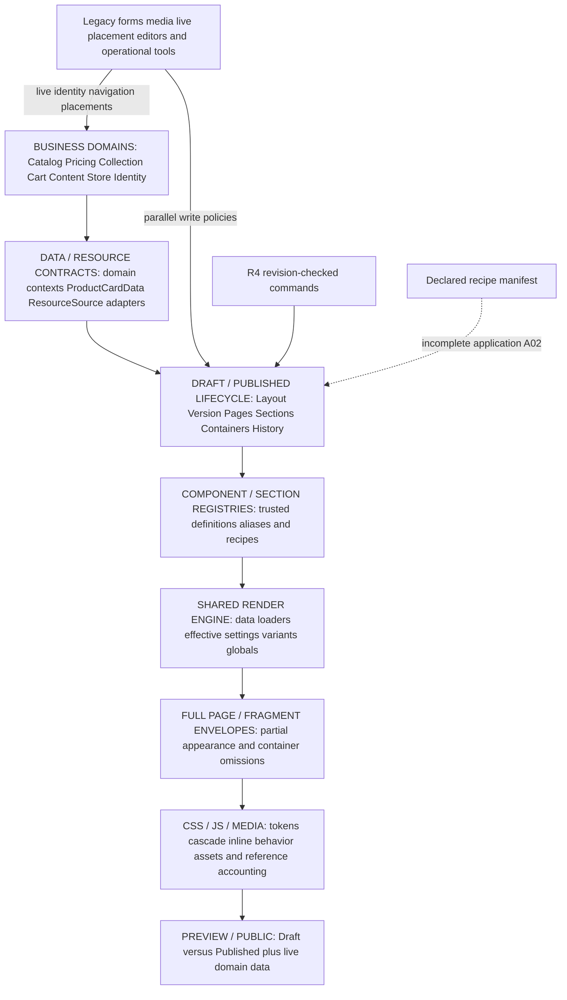

# 07 — Master current-state blueprint

Baseline: `audit/storefront-appearance-g23`, HEAD `93c5afea2ee32bef67cfb5923ffdb13bb61d7930`; 2026-09-05.

Evidence convention: **FACT** = source or executed read-only validation; **INFERENCE** = consequence, not an observed production incident; **RECOMMENDATION** = proposed architectural direction; **UNKNOWN** = needs deployment evidence or a Product Owner decision. Source paths are relative to `D:/Projects/RastiSi4_Golden_Manual/`; `:line` identifies the baseline source. No business database was queried or mutated. Existing audit remains unchanged.

Source locator shorthand used below: bare Builder modules (`models.py`, `views.py`, registries, schemas and `r4_views.py`) are under `apps/storefront_builder/`; service modules under `apps/storefront_builder/services/`; typed manifest modules under `apps/storefront_builder/storefront_appearance/`; bare test modules under `apps/storefront_builder/tests/`. Section/partial template names resolve beneath `apps/storefront_builder/templates/storefront_builder/`; `r4/editor.html` resolves to `apps/storefront_builder/templates/dashboard/storefront_builder/r4/editor.html`. Catalog/Cart/Content template names resolve beneath the corresponding app's `templates/` directory. Root shells are `templates/base.html` and `templates/storefront_shell.html`. CSS: `apps/core/static/css/tokens.css`, `theme_palette.css`; `apps/catalog/static/css/home.css`, `product_card.css`, `product_list.css`, `product_detail.css`; `apps/storefront_builder/static/css/storefront_builder.css`, `storefront_builder_preview_v22.css`; `apps/cart/static/css/cart.css`.

## Executive overview for the Product Owner

This document is the decision baseline for Appearance, Builder and Ready Templates at the verified commit. It combines the original architecture audit with the six closure reports, adding a complete bounded writer census, merchant control coverage, normalized comparisons of all 50 recipes and explicit retirement/decision gates. It authorizes no implementation.

**1. What exists today?** RastiSi has one versioned layout system covering six page types, a common section renderer,36 registered section types, trusted component/global-region registries,50 latest Ready recipes and a working set of merchant editors. Global Header/Footer/Mobile selections and store appearance are stored with a layout version, while products, prices, cart behavior, menus and much store identity remain domain-owned live data. The older editor exposes six-page editing; the R4 shell is Home-only and provides a smaller set of controls with stronger concurrency handling. There are40 deliberately counted merchant capability groups:3 WORKING,21 PARTIAL,6 LEGACY-ONLY,4 CONFLICTING,5 MISSING and1 UNKNOWN. These labels describe bounded capabilities, not a whole-product pass rate.

**2. What is strong and should be preserved?** Keep the shared renderer, domain services, store/membership authorization, trusted renderer allowlists, version promotion/clone/restore, stable section identities and recovery snapshots. Product cards already share a domain-backed data contract and template. Brand variants share one ordered store-scoped loader; Collection Tiles share their loader too. Ready Templates are recipes rather than separate hardcoded storefront engines. None of these findings supports rewriting commerce, pricing, inventory, cart or authentication.

**3. What is duplicated?** The original audit established14 conceptual overlaps, including intentional adapters and snapshots as well as dangerous parallel writes. Multiple editor generations write the same version/settings through different rules. Typed selection coexists with legacy mirrors and local section selectors. Containers coexist with row and single-cell-pointer representations. Public fragments reconstruct only part of full-page state. CSS and inline behavior have several owners. The closure findings refine those14 groups rather than pretending every extra path is a new duplicate engine.

**4. Which duplication is harmless or intended?** Version snapshots, template baselines, token aliases, source adapters and compatibility wrappers have legitimate purposes. A historic version is not another live source of truth. A typed resource translated into legacy storage is not automatically two stored authorities. A Home compatibility function delegating to the shared renderer is not a second renderer. These should be retained until their consumers and recovery obligations are understood.

**5. Which duplication is dangerous?** Older dictionary forms can erase the typed manifest or save selectors that the renderer ignores. Other routes edit Draft state without advancing/checking the R4 revision. The complete census finds86 mutation-capable scoped routes:76 explicit writes and10 additional initialization GET routes; only3 explicit endpoints use R4 revision protection. An additional source trace shows legacy live Hero/Banner forms can address same-store section-associated placements without checking Published/Draft status. These are concrete authority/lifecycle differences, not evidence of a cross-store data leak or a measured production incident.

**6. What is missing?** Only 4 of36 sections have R4 SettingsSchema support. The typed family manifest has empty settings allowlists; it selects components but does not supply a full shared appearance contract. There is no general Page Override object, no per-variant settings memory, no general content-preserving template transition, no implemented independent MegaMenu family beyond none, and no established complete browser/mobile certification matrix. Some defaults and recipe settings also lack direct controls in older forms. The generic placement form assumes desktop/mobile files and does not provide working Story single-image add/edit, despite supporting existing Story rendering and lifecycle actions.

**7. What only looks implemented because aliases exist?** The 119 typed component keys resolve to90 symbolic references, including geometry, enums and virtual entries. Hero's19 keys map to6 renderer references; product-view13 to6; layout17 to8. hero.none resolves to an overlay renderer if selected live, although recipe generation separately omits Hero sections for none. dense_five maps to four-column geometry and also sets grid_density6. Such names are not independent visual implementations or proof of live re-layout behavior.

**8. Where does “fix one, break another” come from?** The shared engine receives state produced by different write policies and rendered through different response/style envelopes. A local setting can be saved correctly and then be overruled by a global selection. A listing filter response can lose the card configuration supplied by the full page. A cart update can rebuild rows without the full container arrangement. A background can reference an asset that deletion accounting cannot see. These are specific convergence gaps; they should be resolved at their boundaries.

**9. Which families are ready for expansion?** Under the declared end-to-end gate, **none yet**. Brand is a strong READY FOUNDATION for shared data and schema-based content changes, not a certified exception to platform risks. Raw implementation material is already ample for Header, Footer, Mobile Navigation, Hero and Category. Improving their contracts has greater immediate architectural value than increasing selector counts.

**10. Which families must be frozen?** All18 requested product-facing families are frozen for unrestricted expansion until applicable platform and family gates pass. That does not mean all existing features are broken. It means no family currently combines a complete appearance contract, uniform mutation/media safety, approved precedence and browser/fragment proof. Mega families additionally need a product definition; heterogeneous “Other” and Story families must not be forced into an invented generic data engine.

**11. Are the50 templates different at code level?** Yes: all 50 have distinct normalized declared-DNA fingerprints, including after removing the defined token/palette layer. There are0 exact duplicate groups and0 whole-recipe alias-only duplicate groups. But they use only 27 distinct Home structural compositions and exactly one common section sequence for each of the five non-Home page types. The recipes reference12 Header,8 Footer,7 Bottom Nav and6 Hero implementations. This is code-distinct recombination with substantial reuse, not evidence of50 independent storefront implementations.

**12. What prevents certification as50 full-store designs?** Beyond missing browser evidence, the closure pass found that preset application does not consume the declared full manifest. R4 template apply synchronizes only header/footer/bottom-nav/motion afterward; other selected families may retain previous Draft state. Therefore declared DNA and effective applied DNA must be separated. The fingerprint count is valid for declarations; it cannot certify the result of applying each recipe to arbitrary existing stores. Preview also uses a different non-Home CSS envelope, and interactive fragments can omit merchant settings.

**13. What must happen before more variants?** Agree ownership and precedence, make declared recipe application faithful, converge revision/lifecycle and media-reference boundaries, preserve appearance across response fragments, and establish a shared content/common-appearance/specific-settings contract per family. Then require desktop/mobile interaction and visual evidence for that family's supported states. Commerce services remain consumers/providers at their current boundaries. These are definitions of readiness, not a file-by-file implementation plan.

**14. What must happen before legacy retirement?** Complete replacement coverage, establish actual callers/adoption, inventory stored settings and legacy geometry/media, and prove rollback including file bytes. The retirement report lists24 grouped items and12 exact blockers. It recommends0 immediate deletions. Removing a route because R4 exists would discard controls/pages R4 does not yet expose; deleting zero-recipe-use sections would ignore manual and archived data.

**15. What remains unknown?** Source cannot establish production usage, current store data shapes, shared-file incidence, actual browser behavior, traffic to old routes or Product Owner intent. Decisions D01–D12 below require owner choices; RB01–RB12 specify targeted external evidence. The code-discovery work can stop at this package. The remaining work is decision-making, targeted deployment evidence and separately authorized planning—not another broad architectural search.

## Current-state system diagram

One diagram only. Legacy/parallel writers enter the same data and lifecycle, rather than a fully separate new storefront engine.

Evidence: Report02 writer tables; Report03 contracts; Report04 apply trace; Report05 envelopes/media. The diagram orders architectural responsibilities, not a claim that the runtime first loads every business record before selecting its version.

## Authoritative count ledger

| Unit | Count / meaning | Reconciliation |
|---|---|---|
| Major persisted appearance authority groups |5 | unchanged; conceptual groups, not databases |
| Major registry catalogs |12 in8 modules | unchanged original catalog convention |
| Typed families / section types |10 /36 | unchanged;18 product-facing groups are a different taxonomy |
| R4-schema section types |4 yes /32 no | unchanged |
| Explicit section variant entries |30 across7 section types | unchanged; not separate template-file count |
| Header / Footer / Mobile registry variants |22 /16 /9 | unchanged including defaults/hidden |
| Typed keys / symbolic references |119 /90 | unchanged; references include virtual/enums |
| Registered renderer template paths |90 | separate coincident number:43 section +47 global paths |
| Latest Ready / latest all presets / retained versions |50 /55 /63 | unchanged; Report03 deliberately uses /50 for usage |
| Token profiles / palettes |10 /64 | unchanged; latest Ready recipes retain token profile identity |
| Declared full / token-excluded fingerprints |50 /50 | new deterministic census, not effective applied-state certification |
| Duplicate / token-only / alias-only whole-recipe groups |0 /0 /0 | new; aliases still exist at component level |
| Home structures / Home settings compositions |27 /49 | new distinct metrics |
| Listing / Search / PDP / Collection / Cart structures |1 /1 /1 /1 /1 | all 50 share common sequence per type |
| Ready-used Header / Footer / Nav / Hero refs |12 /8 /7 /6 | used subset, not registry totals;45 recipes instantiate Hero |
| Explicit HTTP writers |76 =45 Builder +31 live presentation/content | new bounded route census |
| Additional GET initialization routes |10 | new; no double count of write/form URLs |
| All mutation-capable routes / revision-safe explicit routes |86 /3 |83 outside R4 edit-revision protocol;73 explicit +10 initialization |
| Multiple-authority / clear monotonic-writer concepts |18 /1 out of19 | new policy-entry definition in Report02 |
| Product capabilities |40:3 working,21 partial,6 legacy-only,4 conflicting,5 missing,1 unknown | new counted rows; page cells not added |
| Families safe now / frozen |0 /18 | recommendation under explicit end-to-end gate |
| Priority backlog |2 P0;7 P1;5 P2;3 P3 | original 1 P0 gains declared/applied manifest blocker A02 |
| Focused executed tests |52 | original 42 +10 A8 declaration tests; no DB setup |
| Immediate safe deletions |0 | unchanged stance |

## A. Preserve list

| Preserve | Why / boundary | Evidence |
|---|---|---|
| Store/domain resolution, membership and permissions | tenancy and publication eligibility remain outside Appearance policy | original §21; dashboard/decorators:48; stores/resolution:277,300 |
| Catalog/pricing/stock/cart/order services | business truth must not be reimplemented per visual variant | original §18–20; Report05 |
| ProductCardData and standard card | shared image/price/eligibility presentation input | catalog/services/product_card_service:100 |
| Shared section/global renderer and trusted registries | reuse one implementation path across lifecycle states | render_service:714; Report03 |
| Version lifecycle and stable identities | supports Draft/Published isolation and recovery | models:188–940; layout_service:636–854 |
| Recipe catalog, retained versions and baselines | immutable authored/reset identity is valuable | layout_preset_registry:187–225; preset_service |
| Source translation/compatibility adapters | intentional bridge; prevents unnecessary data rewrite | resource_source:321; Report06 |
| G2.3 background/Brand layout regressions | verified baseline behavior should survive future convergence | test_g23_builder_public_content_appearance |
| Live domain content ownership | logo/menu/Brand/catalog changes are distinct from layout publication | Report01/02; decision D10 |

## B. Architectural debt list

| Debt | Severity / owner boundary | Consequence / evidence |
|---|---|---|
| Old forms vs typed manifest | P0 write authority | discarded/ignored selections; Report02 A01 |
| Recipe declarations not fully consumed | P0 recipe-to-persistence | applied state depends on previous manifest; Report04 A02 |
| Partial revision and placement lifecycle coverage | P1 editing/lifecycle | stale accepted writes; old media can reach same-store Published rows; Report02 |
| Partial envelopes and CSS | P1 response/presentation | card/container/form-label loss and Preview CSS mismatch; Report05 |
| Incomplete media reference graph | P1 lifecycle/storage | retained visual/history state can lose asset bytes; Report05 |
| Global versus local control ambiguity | P1 appearance scope | saved local change masked; Report03 |
| Replacement Apply and inconsistent playback contract | P1 product semantics | content loss in composition switch; controls differ; Report04/05 |
| Geometry/schema/query/JS/alias bridges | P2 family normalization | localized drift risk; Reports03/06 |

## C. Missing capabilities

| Missing or incomplete | Existing substitute is insufficient | Decision / evidence |
|---|---|---|
| General Page appearance override | page-owned sections are composition, not inheritance | D01/D04; models:518 |
| Complete common/specific schema contract | four section schemas and empty typed family settings | A14; Report03 |
| Content-preserving template switch | checkpoint/undo restores old state, does not map content into new layout | D05; preset_service:443 |
| Per-variant settings memory | general undo is not remembered customization per choice | D06 |
| Independent Mega-family contracts | dropdown/columns markup and virtual none do not establish them | D07 |
| Uniform revision/media/history boundary | three protected endpoints cannot cover all 86 routes | A03 |
| Full-store browser/mobile certification | static tests, paths and gallery thumbnails are insufficient | A15/D12 |

## D. Family readiness matrix

All statuses are architectural recommendations, not claims of failed deployed storefronts. Gate A01/A02/A03/A05/A06/A07 applies where the family consumes those platform responsibilities.

| Family | Foundation to reuse | Missing before expansion | Now |
|---|---|---|---|
| Header |22 trusted global variants/live domain context | one writer, roles, live scope, browser/OOB proof | FROZEN |
| MegaHeader/MegaMenu |existing menu domain; virtual none | product definition and real configurable contract | FROZEN |
| Hero |6 paths; HeroSlide loader; schema on hero_banner | media/interaction/precedence and static exception | FROZEN |
| Slider |Hero loader/shared slider partial | schema/playback contract and parity | FROZEN |
| Category |11 modes/shared category builder | schema/representative media budget/responsive contract | FROZEN |
| Collection |2 tile variants/shared list; detail domain context | schema and page/fragment evidence | FROZEN |
| Product Showcase |source resolver/card DTO/wall aggregation | query/presentation contracts and full/fragment fidelity | FROZEN |
| Brand Showcase |3 variants, ordered scoped loader and schema | common appearance/revision/browser proof | FROZEN; READY FOUNDATION |
| Ribbon/Promo |banner placements and promo sections | unified bounded content/media contracts | FROZEN |
| Story/Editorial |rich_text schema plus domain/static sections | semantic subcontracts/media/schema coverage | FROZEN |
| Newsletter |labels and subscription service | schema/custom response-label/interaction proof | FROZEN |
| Footer |16 global variants/live footer data | selector/live gates/CSS policy | FROZEN |
| MegaFooter |existing footer columns | independent-family product decision | FROZEN |
| Mobile Bottom Navigation |9 choices incl hidden | dedicated control contract and mobile/OOB proof | FROZEN |
| Product Detail |domain product context and section components | assets/single behavior definition/schema | FROZEN |
| Listing/Search |shared filtering/domain cards | full/fragment appearance and page controls | FROZEN |
| Cart |domain calculations/required sections | container-aware fragments and page controls | FROZEN |
| Other |FAQ/trust/links implementations | bounded separate schemas rather than generic engine | FROZEN |

## E. Source-of-truth problems

| Concept group | Actual current winner | Architectural problem | Authority decision |
|---|---|---|---|
| Global selectors | nondefault manifest; defaults delegate to mirrors | old saves may be ignored/manifest erased | A01, D01/D02 |
| Recipe identity/DNA | provenance can change while full manifest retained | declaration ≠ applied state | A02, D05 |
| Local variant/card | global overlay can win | no general local override intent marker | A07, D02 |
| Local typography | enabled supported local font/scale wins | different rule from variants/cards | D01 |
| Geometry | stored containers/blocks; row/pointer fallback | manifest layout alias does not rebuild geometry | A11/D01 |
| Colors | version palette/overrides + role cascade; live fallback | old live color UI and roles confuse ownership | A01/A06 |
| Media | FK + JSON/files/domain references | cleanup sees only part of graph | A05/D11 |
| Revision/publish | R4 revision owner, one low-level lifecycle service | competing entry policies skip revision | A03 |

Report02's19-row concept census is authoritative for all writers/readers, preservation and exact counts. No immutable snapshot is counted as a competing live source simply for existing.

## F. Legacy retirement blockers

| ID | Required evidence/decision |
|---|---|
| RB01 | endpoint/editor/client adoption and traffic |
| RB02 | deployed visual flags, pointers and page coverage |
| RB03 | stored settings/selector/source/mirror shapes |
| RB04 | row/cell/block/identity and old snapshot census |
| RB05 | complete file/asset/JSON/archive/history reachability |
| RB06 | precedence/local/Page policies |
| RB07 | template switch/reset and variant memory guarantees |
| RB08 | locks and live-versus-versioned content boundary |
| RB09 | full declared-to-applied recipe proof |
| RB10 | browser desktop/mobile/full/fragment parity |
| RB11 | reversible migration and retained file-byte recovery |
| RB12 | family/none/retention/certification product scope |

Report06 supplies the24 retirement rows and exact applicability. No broad deletion is justified.

## G. Template DNA reality

| Question | Factual answer | Limit |
|---|---|---|
|50 identical recipes? | No:50 normalized full fingerprints | declared recipe inputs |
|Only palette differences? | No whole-recipe token-only groups under stated normalization | not a visual similarity score |
|Unique Home structures? |27;49 with section settings | variants/settings are not geometry |
|Different non-Home layouts? |one common sequence per page type | global/card/token differences still exist |
|Unique global designs? |12 Header /8 Footer /7 Nav refs in recipes | not all22/16/9 used |
|Hero variety? |6 implementations;45 recipes instantiate Hero | none alias isn't live hide |
|Applied full DNA reliable? | source exposes A02; no unconditional guarantee | starting manifest/entry route matters |
|50 certified full-store designs? |not established | later browser/apply/lifecycle proof needed |

## H. QA/certification gaps

| Proof class | Current evidence | Missing guarantee |
|---|---|---|
| Contract/allowlist |52 focused tests executed | no implication of application roundtrip correctness |
| Template loadability |90 registered paths compile | no visual/cascade/interaction proof |
| Server/roundtrip | selected existing assertions inspected, not rerun | all 50 × six pages × custom state not established |
| Revision/tenant | scoped R4 assertions inspected | every old/live/media entry policy not converged |
| Fragments | source traced; named omissions identified | customized card/container/form/OOB parity |
| Media | existing FK lifecycle assertions | JSON/history/shared-file retention |
| Browser/mobile | no closure browser run | actual visual, responsive, accessibility and interaction certification |

## Prioritized architectural backlog — not an implementation plan

Priority expresses readiness sequencing. Rows describe problems and definitions of architectural done, not code tasks or authorization. **2 P0 and7 P1**. Original R1–R14 all map below.

| ID | Priority | Problem | Why it matters | Dependency | Definition of architectural done | Evidence |
|---|---|---|---|---|---|---|
| A01 | P0 | Competing/lossy appearance writers | Unrelated edits erase or contradict typed selections | D01/D02; RB03 | One preservation-aware authority for every editable concept; all active callers obey it | Original R1/C01/C02; Report02 F/R profiles |
| A02 | P0 | Declared Ready manifest is not fully applied | Recipe identity can claim one DNA while effective manifest retains prior choices | A01; RB09 | All ten declared selections and applicable settings have explicit applied/effective semantics independent of accidental starting state | Report04; preset_service:275; r4_mutation_service:393 |
| A03 | P1 | Incomplete revision/lifecycle boundary | Legacy/media/live-placement paths can change data outside R4 concurrency, including same-store Published placements | A01; D09/D10; RB01/RB08 | Every editable appearance/media action has an explicit lifecycle target and one concurrency policy; stale conflicting edits cannot silently succeed | Original R2/C04; Report02 A03 evidence |
| A04 | P1 | Fragment context loss | Listing card settings, Cart containers and Newsletter custom label are not consistently carried into responses | A01; supported page contract | Every partial preserves the merchant-owned appearance/content within its replacement scope | Original R3/C09; Report05 B |
| A05 | P1 | Incomplete media reachability | Asset cleanup cannot see background/history JSON and shared legacy filenames | D11; RB05/RB11 | A retained visual/recovery state cannot reference a physically deleted asset under supported operations | Original R4/C11; Report05 D |
| A06 | P1 | CSS ownership and Preview asset mismatch | Shared HTML still yields ambiguous cascade and non-Home assets | D01; A04; RB10 | Token/component/local authority and page asset contract explicit; browser parity demonstrated | Original R5/C10; Report05 A/C |
| A07 | P1 | Global/local variant precedence unresolved | A valid saved local choice may be visually masked | D01/D02/D04; A01 | Effective source and override rules explicit per concept; compatibility treatment approved | Original R6/C03; Report03 |
| A08 | P1 | Template Apply versus content-preserving switch unresolved | Replacement recreates covered pages; recovery is not content preservation | D05/D06; A02/A05 | Merchant guarantees for Apply/reset/switch clear and proven against existing content and recovery states | Original R7; Report04/06 |
| A09 | P1 | Shared Hero/slider settings exceed common behavior | A control can mean different things across Hero implementations | A03/A05/A07; family contract | Every exposed playback/control setting honored or explicitly unsupported across variants; interaction proof exists | Original R8/C12; Report03/05 |
| A10 | P2 | Copied product variantSelector registration | A fix can diverge between Preview and public detail | A06 | Single behavior authority reaches both consumers with equivalent product-option behavior | Original R9/C13; Report05 E |
| A11 | P2 | Row/cell/block compatibility remains authoritative in different callers | Legacy rebuilds can lose modern composition semantics | A03; RB04 | One geometry owner; historical readers/projections retain stable identities/content and recovery | Original R10/C05; Report06 L12/L13 |
| A12 | P2 | Alias and identity semantics are misleading | none/dense_five and token-profile/recipe terminology imply unsupported behavior | D07/D08; A02 | Catalog distinguishes implementation, recipe directive, no-op and identity; counts are honest | Original R11/C07; Report04 |
| A13 | P2 | Product-family query/presentation policies vary | Older shelves/walls/special offers can diverge while domain prices remain shared | A04/A06; domain contract | Family result and presentation responsibilities explicit without replacing pricing/visibility/cart logic | Original R12/C08/C14; Report05 F |
| A14 | P2 | Sparse settings schemas and incomplete common/Page appearance | 32 section types lack R4 schema; family settings allowlists empty | D01/D04; A01/A07 | Supported family content/common/specific controls are schema-defined with preservation guarantees | Original R13/C06; Report03 |
| A15 | P3 | 50 declared recipes lack full-store certification | Catalog uniqueness does not establish browser/mobile differentiated designs | A02–A09; D12; RB10 | Agreed design/device/state matrix certified; declarations, actual application and rendered behavior agree | Report04/05 |
| A16 | P3 | Historical architecture language can mislead future decisions | Retired families may be mistaken for current engines | accepted closure baseline | Current blueprint owns terminology and counts; historical claims clearly dated | Original R14; Report06 L23 |
| A17 | P3 | Legacy retirement lacks adoption/data/rollback proof | Source-active compatibility cannot safely be deleted yet | RB01–RB12 | Each retired item has caller/data/rollback evidence; required history and domain behavior survive | Report06 |

## Product Owner decision register

Recommendations below are explicit proposals, **not silently adopted policy**. Code can establish current behavior; it cannot decide merchant promises, retention budgets or rollout preference. Optional third choices are described only where materially useful (D02 force-all exception is a distinct explicit policy, not hidden precedence).

### D01 — What is target precedence: Template → Store → Page → Section?

| Field | Decision record |
|---|---|
| Current behavior | Current precedence differs by concept; nondefault manifest beats local variant/card, local enabled typography beats global; no Page layer. |
| Option A | Adopt explicit defaults/inheritance with local override and approved Page scope. |
| Option B | Keep store-enforced variants/cards, document exceptions and effective source. |
| Engineering consequence | A requires scope-aware inheritance and migration compatibility; B keeps forcing semantics but UI must explain masked settings. |
| Migration consequence | Existing stores need preserved effective output; flipping precedence globally without mapping is unsafe. |
| Recommended option | **RECOMMENDATION:** A, subject to explicit locked/store-enforced exceptions. |
| Why | Predictable customization; separates defaults from intentional constraints. |
| Can code decide it? / evidence | Code proves current behavior, cannot decide desired hierarchy. Reports02/03; original §6. |

### D02 — Should a local Section variant override global manifest selection?

| Field | Decision record |
|---|---|
| Current behavior | Nondefault global hero/product-view choice overlays saved local selector. |
| Option A | Global choice supplies default; explicit local selector wins. |
| Option B | Global choice forces all matching sections; local control disabled/explained while forced. |
| Engineering consequence | A needs explicit local-vs-inherited intent; B needs clear locked/effective source controls. |
| Migration consequence | Must distinguish existing default-looking values from deliberate local choices; data census needed. |
| Recommended option | **RECOMMENDATION:** A for ordinary customization, with a separately explicit force-all policy if needed. |
| Why | Avoid saved-but-invisible changes without losing store-wide defaults. |
| Can code decide it? / evidence | Cannot decide intent from present values alone. render_service:743–761; RB03. |

### D03 — How should legacy editors retire?

| Field | Decision record |
|---|---|
| Current behavior | Old routes support controls/pages not in R4 and remain callable. |
| Option A | Converge shared backend contract, then migrate UI family/page by family/page with compatibility adapters. |
| Option B | Disable old UI/routes in one cutover after full replacement proof. |
| Engineering consequence | A supports gradual adoption with common safety; B demands complete parity and integration coordination. |
| Migration consequence | A preserves old payloads temporarily; B needs complete inventory and reversible rollout. |
| Recommended option | **RECOMMENDATION:** A. |
| Why | Existing non-Home and media controls prevent an honest immediate cutover. |
| Can code decide it? / evidence | Code proves coverage gap; adoption/traffic requires RB01 and owner rollout choice. |

### D04 — Should Page Override be a real product capability?

| Field | Decision record |
|---|---|
| Current behavior | Page owns composition but has no appearance JSON/resolver. |
| Option A | Add an explicitly bounded Page appearance scope. |
| Option B | Keep appearance global plus section-only; no Page override promise. |
| Engineering consequence | A requires inheritance and effective source at four scopes; B reduces complexity but constrains full-store design. |
| Migration consequence | A needs default inheritance preserving existing appearance; B no new scope migration. |
| Recommended option | **RECOMMENDATION:** A only for named merchant needs, initially a bounded subset. |
| Why | Page designs may need control, but a universal scope should not be silently invented. |
| Can code decide it? / evidence | Product priority/fields cannot be decided by code. models:518–575. |

### D05 — Does template Apply replace/reset or preserve compatible content?

| Field | Decision record |
|---|---|
| Current behavior | Covered page sections/containers are deleted/recreated; recovery checkpoints/history exist. |
| Option A | Keep explicit Replace/Reset and provide a separate content-preserving switch contract. |
| Option B | Keep replacement-only with clear content/recovery consequences. |
| Engineering consequence | A needs semantic compatibility guarantees between family slots; B has simpler deterministic baseline behavior. |
| Migration consequence | A needs content/source/media/stable-ID mapping; B needs recoverable pre-replacement state and files. |
| Recommended option | **RECOMMENDATION:** A if switching existing merchant stores is a product promise; retain explicit reset. |
| Why | Switch and reset solve different needs; recovery alone does not preserve work in place. |
| Can code decide it? / evidence | Code proves replacement; owner must choose promised guarantee. preset_service:443–460. |

### D06 — Should each variant remember its previous custom settings?

| Field | Decision record |
|---|---|
| Current behavior | One current settings object plus general undo, no per-variant memory. |
| Option A | Remember shared content once and variant-specific overrides separately. |
| Option B | Keep one shared current settings object; rely on undo for reversals. |
| Engineering consequence | A adds settings-memory/version semantics; B requires strict compatible shared fields and honest switch UX. |
| Migration consequence | A needs initial defaults and old-value mapping; B keeps simpler data model. |
| Recommended option | **RECOMMENDATION:** B initially; add A only for concrete distinct per-variant fields. |
| Why | Avoid unnecessary hidden state while common/specific contracts are incomplete. |
| Can code decide it? / evidence | Code cannot establish merchant preference. settings_schema:310; models:608. |

### D07 — Are MegaHeader/MegaMenu/MegaFooter real independently configurable families?

| Field | Decision record |
|---|---|
| Current behavior | Header/footer have rich markup; mega_menu only virtual none, no independent MegaFooter. |
| Option A | Define real product families with data and appearance contracts. |
| Option B | Treat advanced navigation/footer layouts as ordinary Header/Footer variants. |
| Engineering consequence | A expands family/settings taxonomy; B keeps taxonomy smaller and variants compositional. |
| Migration consequence | A requires mapping existing menu/footer data; B must avoid marketing claims of independent capabilities. |
| Recommended option | **RECOMMENDATION:** B unless independent configuration/reuse requirements justify A. |
| Why | Existing domain menus/footer content can be reused without speculative new engines. |
| Can code decide it? / evidence | Code proves absence, not product scope. global registries; families:98. |

### D08 — What does hero.none mean when selected live?

| Field | Decision record |
|---|---|
| Current behavior | Alias resolves Hero overlay; A8 recipe separately omits Hero sections. |
| Option A | none hides/disables Hero presentation without deleting content. |
| Option B | none is a recipe-only omission directive, excluded/renamed in live selection. |
| Engineering consequence | A requires explicit visibility semantics distinct from removal; B keeps runtime selection simple. |
| Migration consequence | Existing hero.none selections need compatibility treatment to avoid surprise disappearing content. |
| Recommended option | **RECOMMENDATION:** A if offered as a live component option; otherwise B. |
| Why | Name must match merchant-visible behavior. |
| Can code decide it? / evidence | Code proves mismatch; intended semantics require owner choice. adapters:31; a8 _home:131. |

### D09 — Does locking a section block structure only or all edits?

| Field | Decision record |
|---|---|
| Current behavior | Structural removal checks lock; R4 settings helper does not. |
| Option A | Define structure-only lock and label it accordingly. |
| Option B | Lock content, appearance, placement and structural operations. |
| Engineering consequence | A aligns with narrow current guards; B needs universal enforcement including media/reset. |
| Migration consequence | Existing locked sections may have expected editability; policy/version mapping needed. |
| Recommended option | **RECOMMENDATION:** A initially, unless protected-template content is a confirmed requirement. |
| Why | Do not silently convert an editing affordance into a broader permission rule. |
| Can code decide it? / evidence | Cannot infer lock intent from inconsistent guards. r4_mutation_service:132; structure service:109. |

### D10 — Do navigation/store identity and fallback placements remain live after publish?

| Field | Decision record |
|---|---|
| Current behavior | Identity, menus, footer content, domain catalog and some store-wide placement fallback are live. |
| Option A | Keep domain identity/navigation live; clearly separate and guard Draft-associated placements. |
| Option B | Snapshot selected navigation/identity/presentation content with layout publication. |
| Engineering consequence | A needs clear UI scope and scoped placement writers; B adds snapshot/update conflict semantics. |
| Migration consequence | B needs initial snapshots and decisions for menu/contact updates; A needs Published placement protection. |
| Recommended option | **RECOMMENDATION:** A for domain identity/navigation; version-associated placements obey Draft/publish. |
| Why | Preserves business ownership and avoids freezing ordinary store operations accidentally. |
| Can code decide it? / evidence | Business policy cannot be chosen by code. context processors; dashboard Hero/Banner A03. |

### D11 — What media recovery do archived versions and undo/history promise?

| Field | Decision record |
|---|---|
| Current behavior | FK rows protect assets; JSON/history/file-name references are not fully counted. |
| Option A | Retain referenced media for all supported recoverable states until explicit expiry. |
| Option B | Limit recovery window and allow expired states to lose media, clearly declared. |
| Engineering consequence | A requires complete reachability; B additionally requires expiry semantics and UI expectations. |
| Migration consequence | Both need historical reference/file inventory; irreversible cleanup cannot precede retention decision. |
| Recommended option | **RECOMMENDATION:** A for all states currently offered as recoverable, then explicit retention policy. |
| Why | Restore should not silently produce broken visuals. |
| Can code decide it? / evidence | Retention duration/cost is policy; current reachability is code fact. Report05 D; RB05/RB11. |

### D12 — How many families must be certified before adding variants?

| Field | Decision record |
|---|---|
| Current behavior | 0/18 pass the end-to-end expansion gate; Brand strongest narrow foundation. |
| Option A | Certify two representative families first (Brand Showcase and Collection), after platform P0/P1 gates. |
| Option B | Require certification of all 18 requested families before any expansion. |
| Engineering consequence | A establishes shared contract evidence with manageable scope; B postpones expansion until large heterogeneous taxonomy converges. |
| Migration consequence | A still needs common migration rules; neither permits bypassing writer/media/fragment safety. |
| Recommended option | **RECOMMENDATION:** A, then one-family-at-a-time certification; Hero follows interaction convergence. |
| Why | Tests both schema-backed Brand and currently legacy Collection without equating raw variant count with readiness. |
| Can code decide it? / evidence | Threshold and rollout priority are product choices; code only supports risk assessment. Report03/05. |

## Cross-report consistency and new knowledge

**FACT:** The original audit was read first and remains unchanged. Catalog counts36/4/30/119/90/50/55/63/10/64 remain consistent. Report03's Ready-use count differs from the original /55 all-preset count deliberately; it lists every changed row and excluded internal recipe. The two different90 counts (symbolic references versus template paths) are never treated as equivalent units. The18 product families are not the10 typed families.

**New closure knowledge:** complete scoped route census and GET initialization surface; direct legacy placement version-scope gap; merchant UI versus callable API distinction; form-branch controls versus validator defaults; all 50 fingerprints and27 structures; full declared manifest omitted by Apply; customized newsletter fragment label omission; unsupported Story add/edit form; explicit12 retirement blockers and12 owner decisions.

**Original risk coverage:** R1→A01; R2→A03; R3→A04; R4→A05; R5→A06; R6→A07; R7→A08; R8→A09; R9→A10; R10→A11; R11→A12; R12→A13; R13→A14; R14→A16. A02 adds a P0 closure qualification rather than silently rewriting the first audit. All14 confirmed overlap groups remain preserved or mapped; no new subjective duplicate count is invented.

**Recommendations never imply commerce rewrite.** Keep domain pricing/visibility/cart/auth/tenant behavior and consume it through shared contracts. Aliases do not count as new visuals; old snapshots do not count as competing live authorities; zero recipe usage does not authorize deletion.

## Validation and final verdict

Baseline branch/HEAD verified before work. Only the original audit was initially untracked; no application files were dirty. Exactly seven closure reports were created under the approved directory. Focused 52 tests passed without database setup; runtime registry/validator/hash enumeration was read-only. Template compilation and final repository verification are recorded with the final check results; no HTTP requests or mutating tools were used.

**Verdict:** Discovery is sufficiently closed for architectural decisions. RastiSi has a substantial reusable storefront foundation, but reliable expansion depends on converging writes, applied recipe identity, response envelopes, media lifetime and family contracts. The remaining unknowns are explicitly bounded deployment evidence and Product Owner choices. Review this blueprint and D01–D12, then separately authorize planning; do not begin implementation from this audit.

NO IMPLEMENTATION OR REFACTOR WAS PERFORMED.
FINAL DISCOVERY PACK COMPLETE.
STOP. DO NOT START IMPLEMENTATION.
